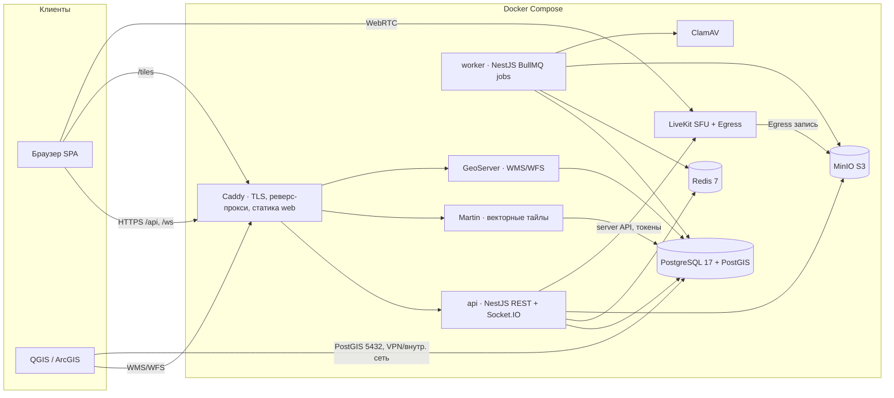

# 01. Архитектура

## Обзор: модульный монолит

Один разработчик + один сервер ⇒ **модульный монолит**. Три собственных процесса (web-статика, api, worker) + готовые инфраструктурные сервисы в Docker. Никаких микросервисов, брокеров сообщений, оркестраторов.

## Компоненты

| Компонент | Технология | Ответственность |
|---|---|---|
| `apps/web` | Vite + React SPA | Весь UI. Собирается в статику, раздаётся Caddy |
| `apps/api` | NestJS (Fastify) | REST `/api/v1/*`, Socket.IO `/ws`, авторизация, бизнес-логика |
| `apps/worker` | NestJS standalone | Фоновые задачи BullMQ (см. ниже). Переиспользует модули api через packages |
| `packages/db` | Drizzle | Схема БД, миграции, типизированные запросы — общие для api/worker |
| `packages/shared` | TS | zod-схемы DTO, константы, каталог прав (CASL), типы WS-событий |
| `packages/ui` | React | Дизайн-система поверх shadcn/ui |
| PostgreSQL+PostGIS | образ postgis | Единственная БД. Схемы: `app`, `gis`, `audit` |
| Redis | redis:7 | Сессии, кэш, presence, pub/sub Socket.IO, очереди BullMQ |
| MinIO | minio | Все бинарные данные (файлы, вложения, записи, превью) |
| LiveKit + Egress | livekit | WebRTC SFU, запись конференций в MinIO |
| Martin | martin | MVT-тайлы из PostGIS для веб-карт; PMTiles-подложка |
| GeoServer | geoserver | OGC WMS/WFS для QGIS/ArcGIS |
| ClamAV | clamav | Антивирус-проверка загрузок (через worker) |
| Caddy | caddy:2 | TLS, реверс-прокси, статика, сжатие |

## Границы модулей backend

`apps/api/src/modules/{auth,users,org,files,gis,incidents,analytics,docflow,signatures,tasks,chat,meet,notifications,admin,audit,search,links}`

Правила:
- Модуль наружу отдаёт только `*.service.ts` (публичные методы) и события. Импортировать чужие репозитории/внутренности запрещено (ESLint boundary-правило).
- Синхронные зависимости: инъекция сервиса (например, docflow → files.service для вложений).
- Асинхронные реакции: доменные события через `EventEmitter2` (`incident.created`, `document.signed`, …). Подписчики: notifications, audit, search. Долгие реакции — постановка job в BullMQ.
- Кросс-модульные связи данных — только через `entity_links` и id, без FK между модулями разных доменов (FK допустимы на ядро: users, org_units, files).

## Потоки

**HTTP**: Браузер → Caddy → Fastify. Порядок: rate-limit → session guard (cookie → Redis) → CSRF (для мутаций) → zod-валидация → permission guard (CASL) → сервис → ответ. Ошибки — единый формат (04-conventions).

**Realtime**: Socket.IO namespace `/ws`, авторизация по той же session cookie в handshake. Комнаты: `user:{id}` (уведомления, звонки-ринг), `channel:{id}` (чат), `board:{id}` (доски), `entity:{type}:{id}` (подписка на карточку). Redis-adapter — чтобы api можно было масштабировать на 2+ процессов (PM2 cluster) в рамках того же сервера.

**Фоновые задачи** (worker, BullMQ): `av-scan`, `preview` (превью изображений/PDF), `text-extract` (текст из PDF/DOCX для поиска), `geo-import` (ogr2ogr), `geo-export`, `notifications` (fan-out), `email` (SMTP), `docflow-deadlines` (cron: контроль сроков, эскалации), `recording-ready` (постобработка записей), `retention` (cron: корзина, записи), `backup-verify` (cron). Повторы с экспоненциальной задержкой, DLQ-очередь `failed` с просмотром в админке.

**Файлы**: загрузка через presigned URL MinIO (браузер → MinIO напрямую, минуя api) → api подтверждает завершение → job `av-scan` → статус файла `clean|infected|pending`. Скачивание — короткоживущие presigned GET через redirect с проверкой прав.

**ГИС**: браузерная карта берёт тайлы у Martin (таблицы/функции PostGIS + PMTiles-подложка); CRUD-геометрии идут через api (валидация + права + аудит). QGIS: прямое подключение PostGIS (отдельные PG-роли, только схема `gis`) или WFS-T через GeoServer. ArcGIS: WMS/WFS GeoServer. Импорт файлов: upload → job `geo-import` (GDAL) → таблица в `gis` + запись в реестре слоёв → автопубликация в GeoServer (REST API) и Martin (авто-каталог).

**Звонки**: api создаёт комнату и выдаёт LiveKit access token (JWT, TTL 10 мин, права по роли в комнате) → браузер соединяется с LiveKit напрямую (WebRTC). Запись: api вызывает Egress → composite MP4 → MinIO → webhook LiveKit → api создаёт карточку записи.

## Сквозные механизмы

- **Конфигурация**: только env-переменные, валидируются zod при старте (fail-fast). `.env.example` — исчерпывающий.
- **Логи**: pino, JSON, request-id (корреляция api↔worker через jobId). Ротация — Docker logging driver. Уровни: prod `info`, dev `debug`.
- **Health**: `GET /api/health` (liveness), `/api/health/ready` (проверка PG/Redis/MinIO). Используется Compose healthcheck и мониторингом.
- **Аудит**: интерцептор + явные вызовы `audit.log(actor, action, entity, diff)` в сервисах. Хранение — `audit.audit_log` (партиции по месяцам).
- **Поиск**: глобальный (Cmd+K) — federated-запрос по модулям (PG FTS, конфигурация `russian`), результаты группами по типу сущности.
- **i18n**: ru (основной), tg. Словари в `apps/web/src/locales`. Бэкенд-ошибки — кодами, тексты рендерит фронт.
- **Время**: БД — timestamptz (UTC). Отображение — Asia/Dushanbe. date-fns-tz.
- **ID**: UUIDv7 (сортируемые) для всех PK.

## Ограничения и допущения

- Один сервер: вертикальное масштабирование. Расчёт — до 500 пользователей, до 100 одновременных участников видео (см. 08-deployment, sizing).
- Допустимый даунтайм при обновлении — минуты (окно обслуживания). Zero-downtime не требуется.
- Внешний интернет может отсутствовать: единственные внешние зависимости при работе — нет; при сборке — npm-реестр (кэшируется).
- Пиковая нагрузка — во время ЧС: критические пути (донесение, карта, уведомления, звонок) оптимизируются в первую очередь.
