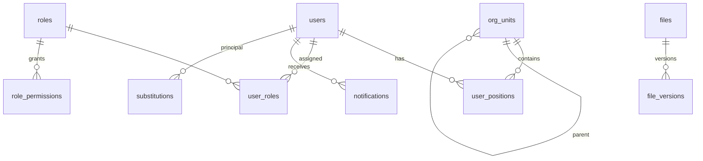

# 07. Модель данных — ядро

Здесь: конвенции + общие таблицы, используемые всеми модулями. Таблицы модулей — в их спеках. Всё описание — «колоночный» уровень; точные типы задаёт агент в Drizzle по конвенциям 04.

## Конвенции
- PG-схемы: `app` (бизнес и ядро), `gis` (пространственные данные — отдельно, т.к. к ней даётся прямой доступ QGIS), `audit`.
- Везде: `id uuid pk (v7)`, `created_at`, `updated_at`, у пользовательских данных `created_by → users`, `deleted_at` (soft delete).
- Геометрия: `geometry(Geometry, 4326)`; хранение WGS84, отображение web-mercator.
- Справочники (dictionaries) — таблицы с `code` (стабильный строковый ключ), `name_ru`, `name_tg`, `sort`, `is_active`.

## ER ядра

## Таблицы ядра (`app`)

**users**: username uq, password_hash, full_name, short_name (И.О. Фамилия), email null, phone null, avatar_file_id null, status `active|blocked`, totp_secret null (шифр.), totp_enabled, must_change_password, last_login_at, locale `ru|tg`, theme.

**org_units**: parent_id null, name, short_name, type `committee|department|division|unit`, path (materialized, `root.a.b`), sort, head_position_id null.

**positions**: org_unit_id, name, rank int, is_head bool.

**user_positions**: user_id, position_id, is_primary. (уникальность user+position)

**roles**: code uq, name, is_system (нельзя удалить). **role_permissions**: role_id, permission (string из каталога). **user_roles**: user_id, role_id, org_unit_id null (скоуп).

**substitutions**: principal_id, deputy_id, scope `all|docflow`, starts_at, ends_at, is_active.

**resource_acl**: resource_type (enum-строка: `folder|file|layer|project|channel|recording|report`), resource_id, subject_type `user|org_unit|role`, subject_id, level `viewer|editor|manager`. Уникальность (resource, subject). Индекс по (resource_type, resource_id) и по (subject_type, subject_id).

**entity_links**: src_type, src_id, dst_type, dst_id, created_by, created_at. Типы: `incident|document|task|file|channel|meeting|recording|report`. Уникальность пары (нормализованной). Двунаправленное отображение в UI («Связи»).

**dictionaries** (одна таблица с type): type (`incident_type|hazard_level|doc_type|correspondent_category|…`), code, parent_code null (деревья — виды ЧС), name_ru, name_tg, sort, is_active, meta jsonb. Крупные иерархии (виды ЧС) допускается вынести в отдельную таблицу при необходимости.

**correspondents** (внешние организации для ДОУ): name, short_name, category_code, address, phones, email, is_active.

**notifications**: user_id, type (строка-код `docflow.route.assigned` и т.п.), title, body, entity_type null, entity_id null, is_read, read_at, created_at. Индекс (user_id, is_read, created_at desc).

**notification_prefs**: user_id, type_group, channel `inapp|email`, enabled. (in-app нельзя отключить для критичных групп: назначения по документам, звонки)

**files**: см. modules/12 (owner_type/owner_id, storage_key, size, mime, checksum sha256, av_status, …) + **file_versions**. Ядро использует file_id как universal-ссылку на бинарь (аватары, вложения).

**comments** (общая для задач/ЧС/документов «обсуждение на карточке»): entity_type, entity_id, author_id, body (rich-json), created_at, edited_at, deleted_at. Индекс (entity_type, entity_id, created_at).

**saved_filters**: user_id, module, name, params jsonb, is_shared.

**user_settings**: user_id, key, value jsonb.

## Схема `audit`

**audit_log** (партиции по месяцам, `created_at`): id, actor_id null (система), action (код `module.entity.verb`), entity_type, entity_id, org_unit_id null, ip, user_agent, meta jsonb (diff/детали), created_at. Индексы: (entity_type, entity_id), (actor_id, created_at), BRIN по created_at. Запись — только вставка; изменение/удаление запрещено на уровне прав PG-роли приложения.

**read_log** — отдельно: факты чтения документов ДСП и скачивания файлов ДСП: user_id, entity_type, entity_id, created_at.

## Поиск (PG FTS)

- Конфигурация `russian`. У поисковых таблиц — generated column `search tsvector` (по названию+номеру+тексту) + GIN.
- Federated-поиск `GET /search?q=` объединяет: documents, incidents, tasks, files, users, channels/messages — top-5 на группу, с проверкой прав в каждом подзапросе.

## Партиционирование и объёмы

- v1 партиционируются: `audit.audit_log`, `app.chat_messages` (по месяцам, pg_partman не берём — создание партиций делает cron-job в worker).
- Ожидаемые объёмы (500 пользователей, 3 года): документы ~200k, сообщения чата ~10М, аудит ~50М, файлы ~2-5 ТБ (MinIO). PG уверенно справляется на одном сервере.

## Сиды (обязательные)

1. Суперадмин (`admin` / временный пароль из env, must_change_password).
2. Роли-шаблоны из 05-auth-rbac.
3. Орг-структура-скелет (корень + примерные управления — правится админом).
4. Справочники: виды ЧС (дерево из modules/10), уровни ЧС, типы документов, категории корреспондентов.
5. Демо-сиды для dev (`db:seed --demo`): 20 пользователей, 50 ЧС по региону, документы, задачи, каналы.
