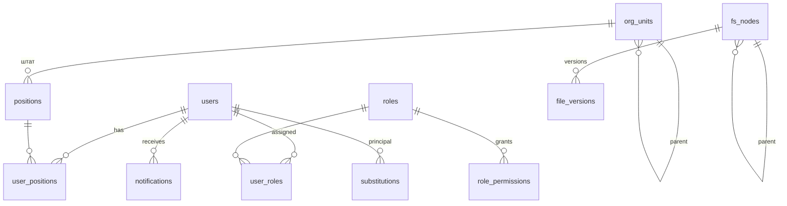
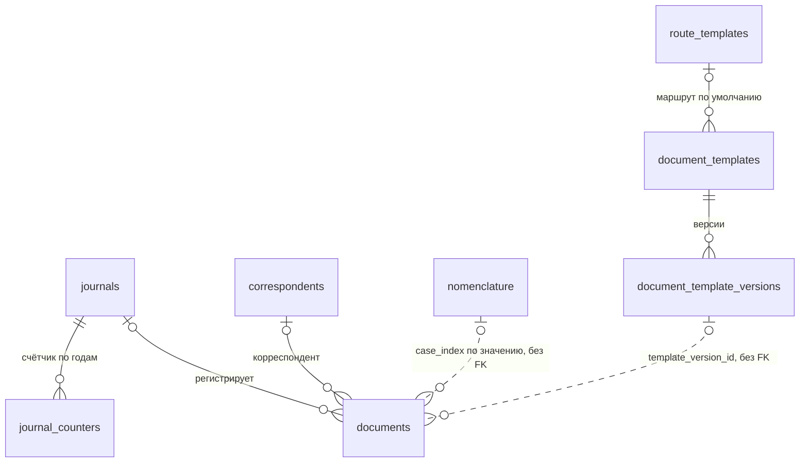
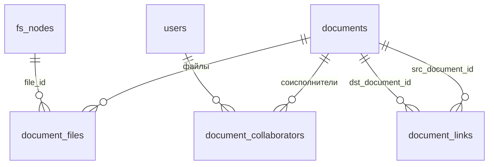
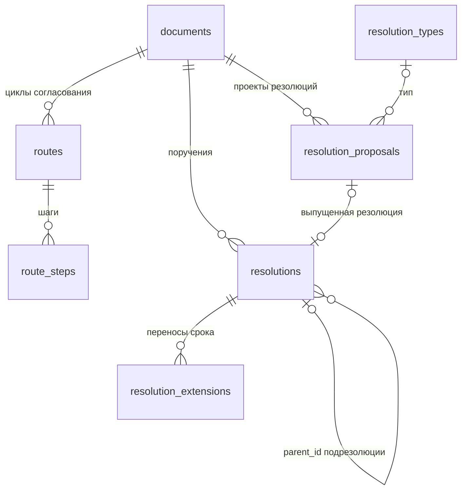
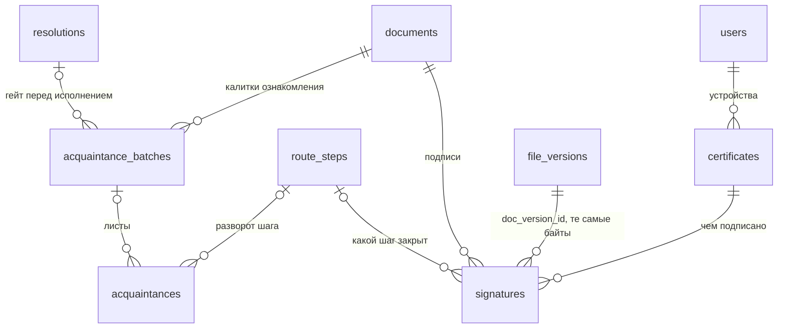
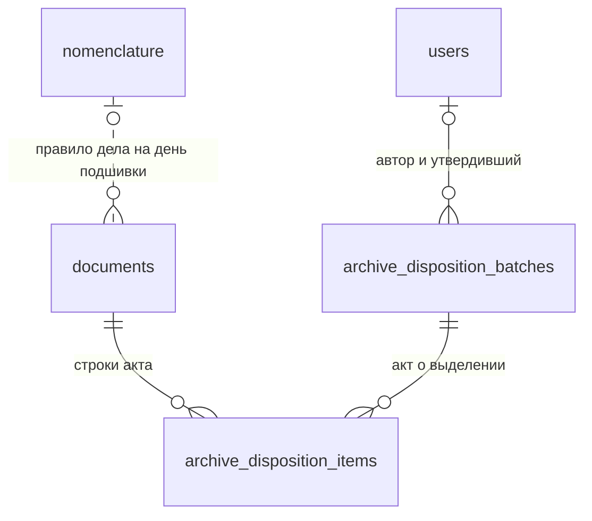
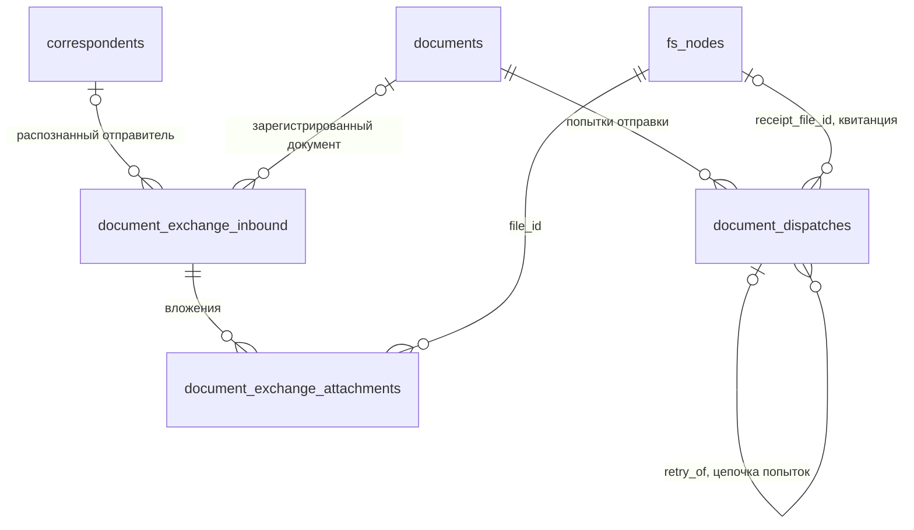

# 07. Модель данных — ядро

Здесь: конвенции, общие таблицы ядра и схема СЭД 2.0 (ДОУ) — самый крупный кластер, чьи инварианты (нумерация, ДСП, архив, обмен) выходят за пределы одного модуля. Прикладные детали модулей — в их спеках (`docs/modules/*`). Описание — «колоночный» уровень; источник правды по типам и индексам — Drizzle-схема `packages/db/src/schema/**` и миграции `packages/db/migrations/**`.

## Конвенции

- PG-схемы: `app` (бизнес и ядро), `gis` (пространственные данные — отдельно, т.к. к ней даётся прямой доступ QGIS), `audit`.
- Первичный ключ: `id uuid pk`, UUIDv7, генерируется приложением (`primaryId()` в `packages/db/src/schema/_shared.ts`) — сортируемый по времени, поэтому индекс по `id desc` годится как tie-breaker.
- Изменяемые бизнес-строки: `created_at`, `updated_at`, у пользовательских данных `created_by → users` и `deleted_at` (мягкое удаление).
- **Исключения из предыдущего пункта — не редкость, а правило для строк-фактов.** Конвенция с молчаливыми исключениями перестаёт быть проверяемой, поэтому стороны названы явно; новая таблица обязана выбрать одну из них. Перечни ниже покрывают **все** таблицы `packages/db/src/schema/**` (схемы `app` и `gis`), включая модульные; таблицы вне drizzle (`packages/db/src/unmanaged/**` — `audit.audit_log`, `audit.read_log`, `app.chat_messages`) конвенцией не охвачены и описаны в §Схема `audit` и §Партиционирование.
  - Только `created_at`, без `updated_at` и без `deleted_at` — таблицы фактов и событий. Ядро и ДОУ: `signatures` (вставка-только, никогда не UPDATE), `acquaintances`, `acquaintance_batches`, `resolution_extensions`, `document_links`, `document_files`, `route_steps`, `certificates`, `document_template_versions`, `archive_disposition_items`, `document_exchange_attachments`, `entity_links`, `role_permissions`, `user_roles`, `file_versions`, `file_links`, `file_link_grants`, `file_uploads`, `totp_backup_codes`, `notifications`, `backup_runs`. Модули: `incident_reports`, `incident_resources`, `gis_db_accounts` (`schema/incidents.ts`), `task_project_members`, `task_labels`, `task_checklist_items`, `task_activity` (`schema/tasks.ts`), `chat_members`, `chat_reactions`, `chat_pins` (`schema/chat.ts`), `meet_calls` (`schema/meet.ts`). У части из них меняется узкое состояние (шаг маршрута доходит до решения, уведомление прочитывают, сертификат отзывают, версия шаблона публикуется) — но «когда строку последний раз трогали» здесь ничего не значит, а мягкое удаление запрещено по смыслу.
  - `created_at` + `updated_at`, но без `deleted_at` — состояния, которые нельзя «удалить», только закрыть. Ядро и ДОУ: `routes`, `resolutions`, `resolution_types`, `document_exchange_inbound`, `resource_acl`, `user_positions`, `dictionaries`, `notification_prefs`, `notification_outbox`. Модули: `gis.admin_units`, `gis.facilities`, `gis.risk_zones`, `gis.layer_features` (`schema/gis.ts`), `gis_imports`, `gis_exports` (`schema/incidents.ts`), `meet_rooms` (`schema/meet.ts`).
  - `app.journal_counters` — только `updated_at`, без `created_at`: у счётчика нет момента рождения, есть последний выданный номер.
  - `document_collaborators` — `deleted_at` без `updated_at`: отзыв гранта это событие, а не правка.
- Геометрия: `geometry(Geometry, 4326)`; хранение WGS84, отображение web-mercator.
- Справочники (`app.dictionaries`, одна таблица с `type`) — `code` (стабильный строковый ключ), `name_ru`, `name_tg`, `sort`, `is_active`.
  **Зафиксированное отклонение:** `app.resolution_types` (СЭД 2.0) использует `name_ru` + `name_tj` и `sort_order`. Схему не переименовываем — миграции применены; новые справочники пишем по конвенции (`name_tg`, `sort`). Отдельной таблицей, а не строкой в `dictionaries`, он сделан потому, что несёт поведенческие колонки (`requires_due_at`, `requires_executor`, `requires_outgoing_response`, `default_control`, `default_due_hours`, `action_kind`), которые в `dictionaries.meta` были бы не проверяемы; ограничение `dictionaries_type_chk` допускает только `incident_type|hazard_level|doc_type|correspondent_category`.
- **Деньги — `numeric`, никогда float.** В схеме таких колонок две, обе `numeric(18,2)` и обе в `packages/db/src/schema/incidents.ts`: `incidents.damage_est` (подтверждённый снимок по ЧС) и `incident_reports.damage_est` (оценка конкретного донесения; рядом с каждой — свободный `damage_note`). Наружу передаётся строкой (docs/04).
- **Время — `timestamptz`, хранение в UTC.** Отображение и, что важнее, *календарные границы* — Asia/Dushanbe: год регистрации, «за сегодня», «по 31 марта» считаются по местной гражданской дате. Поэтому регистрация в 2026-12-31T19:30Z попадает в книгу 2027 года (`businessDateParts()` из `@cuks/shared`, применяется в `apps/api/src/modules/docflow/docflow-numbering.service.ts`).
- **Дробные ключи порядка (fractional index, base-62) — `text collate "C"`.** Коллация кластера `en_US.utf8` переставляет базовый алфавит (даёт `8,d,G,l,V` вместо `8,G,V,d,l`), поэтому колонки `task_columns.order_key`, `tasks.order_in_column`, `task_checklist_items.order_key` объявлены как `text collate "C"` (`orderKeyCol` в `schema/tasks.ts`, миграция `0038`). Следствие для любого нового запроса: **сравнение двух ключей порядка в SQL должно нести коллацию** — иначе поиск соседа перемешает доску или свалится.
- **Ссылки на файлы.** `file_id` — это `fs_nodes.id`, узел дерева; в ДОУ и в ГИС-импорте это настоящий FK: `document_files.file_id`, `document_exchange_attachments.file_id` (оба `on delete restrict`), `document_dispatches.receipt_file_id`, `gis_imports.file_id` (оба `on delete set null`). Два отступления, оба **без FK**: `users.avatar_file_id` (см. §Таблицы ядра) и чат — у `app.chat_messages` не `file_id`, а массив `file_ids uuid[]` (ручная DDL, миграция `0042`, `packages/db/src/unmanaged/chat-messages.ts`), и код чата нигде не резолвит его против `fs_nodes`. Неизменяемый срез байтов — `file_versions.id`; именно он пиннится там, где важны «те самые байты»: `signatures.doc_version_id`.

## ER ядра

```mermaid
erDiagram
  users ||--o{ user_positions : has
  org_units ||--o{ positions : "штат"
  positions ||--o{ user_positions : ""
  org_units ||--o{ org_units : parent
  users ||--o{ user_roles : assigned
  roles ||--o{ user_roles : ""
  roles ||--o{ role_permissions : grants
  users ||--o{ notifications : receives
  fs_nodes ||--o{ file_versions : versions
  fs_nodes ||--o{ fs_nodes : parent
  users ||--o{ substitutions : principal
```

## Таблицы ядра (`app`)

**users**: username (partial-uq среди живых), password_hash, full_name, short_name (И.О. Фамилия), email null, phone null, avatar_file_id null (без FK — добавляется на уровне приложения), status `active|blocked`, totp_secret null (шифруется на уровне приложения), totp_enabled, must_change_password, last_login_at, locale `ru|tg`, theme `system|light|dark`, quota_bytes null (личная квота файлов; null = платформенный дефолт).

**org_units**: parent_id null, name, short_name, type `committee|department|division|unit`, path (материализованный, `root.a.b`, индекс `text_pattern_ops` под `path like 'x.%'`), sort, head_position_id null (без FK — цикл с positions), admin_unit_id null (территория из `gis.admin_units`; null у центрального аппарата = видит всё), quota_bytes null.

**positions**: org_unit_id, name, rank int, is_head bool.

**user_positions**: user_id, position_id, is_primary. Уникальность (user, position) + partial-uq «не более одной основной должности на пользователя».

**roles**: code (partial-uq среди живых), name, is_system (нельзя удалить). **role_permissions**: role_id, permission (строка из каталога `packages/shared`), уникальность (role, permission). **user_roles**: user_id, role_id, org_unit_id null (скоуп; уникальность (user, role, org_unit) с `nulls not distinct` — глобальное назначение это одно конкретное значение).

**substitutions**: principal_id, deputy_id, scope `all|docflow`, starts_at null, ends_at null (null = бессрочно), is_active, created_by, мягкое удаление. Индексы (deputy_id, is_active) и (principal_id).

**resource_acl**: resource_type `folder|file|layer|project|channel|recording|report`, resource_id, subject_type `user|org_unit|role`, subject_id, level `viewer|editor|manager`. Уникальность (resource_type, resource_id, subject_type, subject_id); индексы по ресурсу и по субъекту.

**entity_links** (`schema/entity-links.ts`): source_type, source_id, target_type, target_id, created_by, created_at. Полиморфные ссылки без FK. Уникальность — по **направленной** четвёрке (`entity_links_pair_uq`); нормализации пары нет, (A→B) и (B→A) могут существовать одновременно, а двунаправленный показ в UI «Связи» делает запрос (объединение `source=id` и `target=id`).
**Разделение с ДОУ:** межмодульная связь (задача ↔ ЧС ↔ документ) — это `entity_links`, её первый потребитель — задачи. Связь документ↔документ живёт в отдельной `app.document_links` со своим `kind` (`related|reply`); модуль docflow к `entity_links` не обращается вовсе. Панель «Связи» на карточке документа должна читать обе таблицы, но за док-к-док семантику отвечает только `document_links`.

**dictionaries**: type (`incident_type|hazard_level|doc_type|correspondent_category`, ограничение `dictionaries_type_chk`), code, parent_code null (деревья — виды ЧС), name_ru, name_tg, sort, is_active, meta jsonb. Уникальность (type, code).

**correspondents** (внешние организации для ДОУ; определена в `schema/docflow.ts`): name, short_name, category_code (код из `correspondent_category`), address, phones, email, is_active, мягкое удаление, `search_tsv` (см. §Поиск).

**notifications**: user_id, type (строка-код, например `docflow.resolution.assigned` или `chat.message.mention`; полный набор кодов задаётся теми, кто их пишет — `NotificationsService.notify` в `apps/api`), title, body, entity_type null, entity_id null, **payload jsonb** (не null, default `{}`), **dedupe_key null**, is_read, read_at, created_at. Индекс (user_id, is_read, created_at desc) + partial-uq `notifications_user_dedupe_uq (user_id, dedupe_key) where dedupe_key is not null` — гарантия «одно событие = не более одной записи на пользователя», благодаря которой повторная доставка безопасна.

**notification_prefs**: user_id, type_group, channel `inapp|email`, enabled. Уникальность (user, type_group, channel); отсутствие строки = дефолт канала. In-app для критичных групп не отключается — проверка в сервисе, не в БД.

**notification_outbox** (`schema/notification-outbox.ts`): topic, payload jsonb, dedupe_key (уникальный), attempts, next_attempt_at, last_error, processed_at. Producer вставляет маркер в **той же транзакции**, что и доменную мутацию; диспетчер забирает строки через `FOR UPDATE SKIP LOCKED`. Partial-индекс `notification_outbox_pending_idx (next_attempt_at, created_at) where processed_at is null` — очередь «что осталось разослать» не сканирует обработанное.

**fs_nodes** (`schema/fs.ts`, см. modules/12): parent_id (self-FK), kind `folder|file`, name, space `personal|org|system`, owner_user_id null, owner_org_unit_id null, current_version_id null (без FK — иначе цикл с file_versions), size_cached (зеркало размера текущей версии, база квот), mime, tags text[], starred_by uuid[], path (материализованный), `search_tsv`, мягкое удаление. Partial-uq `fs_nodes_org_root_uq` — не более одного корня на орг-единицу.

**file_versions**: node_id, version, storage_key, size, mime, checksum_sha256, **uploaded_by null**, av_status `pending|clean|infected`, extracted_text null, `extracted_tsv`. Уникальность (node_id, version). `uploaded_by` стал nullable миграцией `0060`: версия, пришедшая транспортом обмена документами, не имеет человека за собой, и подставить имя означало бы записать неправду в аудит. Любая человеческая загрузка по-прежнему пишет загрузившего.

**file_uploads / file_links / file_link_grants**: стейджинг незавершённой multipart-загрузки; внутренние ссылки-доступы (`token`, `expires_at`) и записи о том, что пользователь ссылку принял (доступ проверяется «вживую» через join, а не материализуется в `resource_acl`).

**comments** (общая для задач/ЧС/документов «обсуждение на карточке»): entity_type, entity_id, author_id, **body text** (обычный текст, не rich-json), **mentions uuid[]**, created_at, updated_at, deleted_at. Индекс (entity_type, entity_id, created_at).

**saved_filters**: user_id, module, name, params jsonb, is_shared, мягкое удаление. Сохранённые представления реестра ДОУ хранятся здесь же — `module = 'docflow_documents'` (`DOCFLOW_VIEW_MODULE` в `packages/shared/src/dto/docflow.ts`).

**totp_backup_codes** (`schema/auth.ts`): user_id, code_hash (sha256), used_at. Уникальность (user_id, code_hash). Сессии живут в Redis, а не в БД.

**backup_runs** (`schema/system.ts`): finished_at, snapshot_id, size_bytes — одна строка на успешный прогон бэкапа, пишется скриптом `infra/scripts/backup.sh`, читается админ-дашбордом.

> Таблицы `user_settings` нет и не было. Пользовательские настройки живут в `users` (`locale`, `theme`, `quota_bytes`), `notification_prefs` и `saved_filters`.

## СЭД 2.0 (ДОУ) — схема `app`

Прикладные правила и экраны — `docs/modules/11-docflow.md` (§3 модель, §12 целевая модель СЭД 2.0). Ниже — таблицы и те инварианты, которые по списку колонок не видны.

### Регистрация: журналы, номенклатура, шаблоны

```mermaid
erDiagram
  journals ||--o{ journal_counters : "счётчик по годам"
  journals |o--o{ documents : "регистрирует"
  correspondents |o--o{ documents : "корреспондент"
  nomenclature |o..o{ documents : "case_index по значению, без FK"
  document_templates ||--o{ document_template_versions : "версии"
  document_template_versions |o..o{ documents : "template_version_id, без FK"
  route_templates |o--o{ document_templates : "маршрут по умолчанию"
```

**journals**: code (partial-uq среди живых — мягко удалённый журнал освобождает код), name, doc_class `incoming|outgoing|internal|citizens`, number_template (например `{П}-{YYYY}/{seq4}`), seq_reset `yearly|never`, org_unit_id null (null = общий журнал), sort, is_active, мягкое удаление.

**journal_counters**: journal_id, year, last_seq, updated_at. **Уникальный индекс `journal_counters_journal_year_uq (journal_id, year)` — это и есть механизм атомарной нумерации:** номер выдаётся через `INSERT … ON CONFLICT (journal_id, year) DO UPDATE SET last_seq = last_seq + 1 RETURNING`, блокировка строки сериализует конкурирующие регистрации, а поскольку выдача идёт внутри транзакции вызывающего, откат регистрации откатывает и инкремент — номер не «прожигается». Два правила, которых в колонках не видно:
- `year = 0` — **не данные, а сентинел**: непрерывная книга (`journals.seq_reset = 'never'`) складывается в этот бакет целиком.
- бакет годовой книги — **гражданский год Asia/Dushanbe**, а не UTC (`docflow-numbering.service.ts`, тесты в `docflow-numbering.service.spec.ts`).

**nomenclature** (номенклатура дел): index (partial-uq среди живых), title, org_unit_id, retention_note, retention_months null, is_permanent, archive_org_unit_id null, disposition_requires_approval (default **true** — необратимое направление требует явного отказа), sort, is_active, мягкое удаление. `retention_months = null` означает «срок не указан»: документ уйдёт в архив без дедлайна и никогда не будет помечен кандидатом на выбытие — угадывать срок хуже, чем не иметь его.

**document_templates**: code (partial-uq среди живых), name, doc_class, document_type_code null, org_unit_id null (null = на весь комитет), route_template_id null, is_active, created_by/updated_by, мягкое удаление.
**document_template_versions**: template_id, version, content_json, content_text, published_at null (null = черновик), published_by, created_by. Уникальность (template_id, version). Опубликованная версия не редактируется: документы носят `template_version_id`, и правка тела задним числом молча переписала бы уже выпущенное.

### Карточка документа

**documents** — ядро ДОУ. Группы колонок:
- регистрация: journal_id null, reg_number null, reg_date null (все три null до регистрации), doc_class, type_code (код записи справочника `doc_type`; её `dictionaries.meta.requiresSignature = true` означает «этот тип подписываем до регистрации» — флаг включающий, поэтому новый тип ничего молча не блокирует), case_index null (**по значению, без FK** — список дел курируется отдельно), registration_key null;
- содержание: subject, summary null, content_json jsonb (TipTap/ProseMirror по allow-list), content_text (плоское зеркало для поиска), template_version_id null;
- участники: org_unit_id, author_id, correspondent_id null, sender_name/sender_contact/recipient_name/recipient_contact (**снимок контрагента, как написано на бумаге** — рядом с `correspondent_id`, а не вместо: справочник потом переименуют или сольют, а это письмо должно остаться прежним);
- состояние: status `draft|on_route|pending_registration|registered|in_progress|completed|archived|rejected|recalled`, version int (оптимистичная блокировка: правка со старым значением отклоняется, а не затирает чужую), due_date null (внутренний срок исполнения), response_due_at null (срок ответа корреспонденту — это другое), outgoing_number/outgoing_date/delivery;
- доступ: confidentiality `normal|dsp`, access_list uuid[]. **ДСП = список доступа ∩ право `docflow.confidential.view`** — оба условия обязательны, реестровый доступ канцелярии/контроля грифа не перебивает (`document-visibility.ts`);
- архив: см. §Архив ниже;
- `search_tsv` — взвешенный вектор, см. §Поиск.

Ключевые индексы и то, что они охраняют:
- `documents_journal_reg_number_uq (journal_id, reg_number) where reg_number is not null` — номер уникален внутри журнала (страховка счётчика);
- `documents_registration_key_uq (registration_key) where registration_key is not null` — идемпотентность атомарной команды регистрации: повтор той же команды проигрывает гонку на 23505 вместо выдачи второго номера;
- `documents_class_reg_date_idx (doc_class, reg_date desc)` — реестр «класс, новейшие сверху»; фильтр по году сделан диапазоном, т.к. `extract(year from …)` индекс использовать не может;
- `documents_reg_number_prefix_idx (reg_number text_pattern_ops)` — якорный префикс: номер вставляют целиком, и `like 'П-2026/%'` не должен сканировать реестр;
- `documents_due_date_idx (due_date) where due_date is not null and deleted_at is null`, `documents_created_at_idx (created_at desc, id desc)` — дедлайн-виджеты и дефолтная сортировка списков.

**document_files**: document_id, file_id → `fs_nodes.id` (узел в `system`-пространстве), kind `main|attachment`, version, title, is_current. Partial-uq `document_files_current_main_uq (document_id) where kind='main' and is_current` — ровно одно текущее основное тело.

**document_collaborators**: document_id, user_id, role `preparer|editor|viewer`, assigned_by, `deleted_at`. Partial-uq (document_id, user_id, role) среди живых — повторная выдача той же роли это no-op, а не второй грант. Соисполнитель получает только то, что даёт роль: ни ДСП-список, ни управление доступом, ни регистрацию он не обходит.

**document_links**: src_document_id, dst_document_id, kind `related|reply` (src отвечает на dst), created_by. `document_links_pair_uq (src_document_id, dst_document_id)` — одна строка на направленную пару; сервис отказывает в self-link и в связи, уже существующей в любую сторону. Показ двусторонний (запрос объединяет `src=id` и `dst=id`).

```mermaid
erDiagram
  documents ||--o{ document_files : "файлы"
  fs_nodes ||--o{ document_files : "file_id"
  documents ||--o{ document_collaborators : "соисполнители"
  users ||--o{ document_collaborators : ""
  documents ||--o{ document_links : "src_document_id"
  documents ||--o{ document_links : "dst_document_id"
```

### Маршруты и резолюции

```mermaid
erDiagram
  documents ||--o{ routes : "циклы согласования"
  routes ||--o{ route_steps : "шаги"
  documents ||--o{ resolutions : "поручения"
  resolutions |o--o{ resolutions : "parent_id подрезолюции"
  resolutions ||--o{ resolution_extensions : "переносы срока"
  documents ||--o{ resolution_proposals : "проекты резолюций"
  resolution_types |o--o{ resolution_proposals : "тип"
  resolution_proposals |o--o| resolutions : "выпущенная резолюция"
```

`route_templates` намеренно не связан с `routes` внешним ключом: старт маршрута **копирует** шаги из `steps jsonb` шаблона, поэтому позднейшая правка шаблона не переписывает уже идущее согласование.

**routes**: document_id, cycle (перезапуск после возврата = новый цикл), status `active|completed|cancelled`, completed_at. Partial-uq `routes_one_active_uq (document_id) where status='active'` — не более одного активного маршрута на документ; на этом держится движок.

**route_steps**: route_id, step_order (шаги с одинаковым порядком — параллельная группа, группы активируются по очереди), kind `approve|sign|register|acknowledge|execute`, mode `sequential|parallel`, assignee_type `user|position|org_unit` + assignee_id (**полиморфно, без FK**, как `resource_acl`), due_hours, status `pending|active|done|rejected|skipped`, decision `approved|rejected|signed|acknowledged`, comment, acted_by, **acted_for** (за кого действовал замещающий — хранится, а не выводится из «acted_by ≠ assignee», чтобы должностной шаг атрибутировался точно, а действие суперадмина не было помечено как замещение), acted_at, activated_at (старт SLA-часов), due_at (`activated_at + due_hours`, материализовано ради индекса), completed_at (терминальный статус — это не то же, что `acted_at`: пропущенный шаг закрывается без действия человека). Индексы: (route_id, step_order); (status, assignee_type, assignee_id) — очередь «на мне»; partial (due_at) `where status='active' and due_at is not null` — SLA-развёртка.

**route_templates**: name, org_unit_id, steps jsonb (`{order, kind, assigneeType, assigneeId, dueHours}[]`), is_active, мягкое удаление.

**resolution_types** (справочник, см. отклонение в §Конвенции): code (uq), name_ru, name_tj, action_kind `execute|acknowledge|reply|review`, requires_due_at, requires_executor, requires_outgoing_response, default_control, default_due_hours null, is_active, sort_order. Выводится из обращения через `is_active`, никогда не удаляется — выданные резолюции должны остаться объяснимыми.

**resolutions**: document_id, parent_id (self-FK — подрезолюции), author_id, executor_id (ответственный), co_executors uuid[], text, due_date, is_control, status `active|done|cancelled`, report, done_at, **available_at** (когда исполнители вообще увидят поручение; null = сразу, будущее значение = закрытая калитка предварительного ознакомления — проверяется в запросе очереди, а не только в UI), accepted_at/accepted_by, returned_at/return_comment. Индексы: (document_id); (executor_id, status); (available_at); GIN по `co_executors` (очередь «Мои поручения» ищет и соисполнителей через containment).

**resolution_extensions**: resolution_id, old_due, new_due, reason (обязателен), extended_by. Накопительный журнал переносов срока — не правка поля, а история.

**resolution_proposals**: document_id, resolution_type_id, text, signer_id (единственный, кто может решить), responsible_executor_id, co_executor_ids uuid[], acquaint_user_ids uuid[] (кто обязан прочитать *до* исполнителей), due_at, is_control, status `draft|pending|approved|rejected|cancelled`, proposed_by, submitted_at, decided_by, **decided_for** (за кого решил замещающий), decided_at, decision_comment, resolution_id (что произвело одобрение). Намеренно **не** статус на `resolutions`: проект — это запрос решения, резолюция — исполняемая инструкция, и слияние сделало бы «rejected» двусмысленным. Индексы: (document_id); partial (signer_id, status) среди живых — очередь «ждёт моего решения».

### Ознакомление и подписи

```mermaid
erDiagram
  documents ||--o{ acquaintance_batches : "калитки ознакомления"
  acquaintance_batches |o--o{ acquaintances : "листы"
  route_steps |o--o{ acquaintances : "разворот шага"
  resolutions |o--o{ acquaintance_batches : "гейт перед исполнением"
  users ||--o{ certificates : "устройства"
  certificates ||--o{ signatures : "чем подписано"
  documents ||--o{ signatures : "подписи"
  file_versions ||--o{ signatures : "doc_version_id, те самые байты"
  route_steps |o--o{ signatures : "какой шаг закрыт"
```

**acquaintance_batches**: document_id, resolution_id null, route_step_id null, kind `route|pre_execution|distribution`, release_at null (когда калитка откроется сама), released_at, released_reason `all_acknowledged|timeout|manual`, created_by. `released_at` — якорь идемпотентности: воркер и последнее подтверждение соревнуются за него, и кто записал первым, тот и открыл. Partial-индекс `acquaintance_batches_release_idx (release_at) where released_at is null and release_at is not null` — развёртка воркера видит только неоткрытые калитки с таймаутом.

**acquaintances**: document_id, route_step_id null, user_id, acknowledged_at null, batch_id null, status `pending|acknowledged|expired|cancelled`, notified_at. **Два уникальных индекса, а не один:** `acquaintances_step_user_uq (route_step_id, user_id)` для строк, порождённых шагом, и partial `acquaintances_batch_user_uq (batch_id, user_id) where batch_id is not null` — потому что у «батчевых» строк `route_step_id` равен NULL, а Postgres считает каждый NULL уникальным, и один индекс пустил бы человека в рассылку дважды. `expired` означает «калитка открылась без этого читателя», а **не** «прочитал»: смешение позволило бы отчитаться таймаутом как соблюдением.

**certificates**: user_id, serial (uq), kind `device`, device_label, public_key_spki, subject_username/subject_full_name/subject_position (снимок владельца на момент выпуска), ca_signature, not_before, not_after, revoked_at, revoked_reason. Отозванный сертификат остаётся в таблице — иначе исторические подписи станет нечем проверить.

**signatures**: document_id, **doc_version_id → `file_versions.id`** (пиннит неизменяемые байты, а не узел файла), user_id, on_behalf_of null («за» отсутствующего — ключ и сертификат всегда фактического подписанта), certificate_id, route_step_id null, algorithm `ECDSA_P256_SHA256`, context `approve|sign|acknowledge`, payload (каноническая подписанная строка), payload_hash (sha256, hex), signature (base64, IEEE P1363), signed_at. Только вставка, никогда UPDATE. Индексы: (document_id), (doc_version_id), (user_id).

### Архив, сроки хранения и выбытие

```mermaid
erDiagram
  nomenclature |o..o{ documents : "правило дела на день подшивки"
  documents ||--o{ archive_disposition_items : "строки акта"
  archive_disposition_batches ||--o{ archive_disposition_items : "акт о выделении"
  users |o--o{ archive_disposition_batches : "автор и утвердивший"
```

Колонки `documents`: archived_at, archived_by, retention_until, retention_months, is_permanent, legal_hold, legal_hold_reason, legal_hold_at, legal_hold_by, disposition_status, disposed_at, disposed_by (миграция `0054`, данные для ранее заархивированных — `0055`). Правила:

- **`retention_until` + `retention_months` — снимок того, что правило дела говорило в день подшивки**, а не ссылка на него: правка номенклатуры через год не должна молча сдвинуть срок, за который кто-то уже отчитался (`planRetention()` в `apps/api/src/modules/docflow/archive-policy.ts`).
- Дело без указанного срока (`nomenclature.retention_months is null`) и дело с `is_permanent` одинаково дают `retention_until = null` — такой документ не подметается кандидатом никогда. Безопасная сторона ошибки.
- **`legal_hold` перебивает любое правило хранения**: под холдом документ не кандидат, не попадает в акт и не может быть выбыт; причина обязательна — холд, который никто не может объяснить, никто не сможет и снять.
- `disposition_status` `none|candidate|pending|approved|rejected|executed`. **Машина вправе выставить только `candidate`**; всё дальше — человеческое решение.
- `executed` = **логическое** выбытие: запись закрыта и остаётся читаемой. Физическое удаление объектов в MinIO не подключено вовсе — утверждённой политики уничтожения в спеках сейчас нет, и до неё безвозвратная операция не пишется.
- Индексы partial: `documents_archived_idx (status, archived_at desc) where archived_at is not null` — опись; `documents_retention_idx (retention_until, disposition_status) where archived_at is not null and is_permanent = false` — развёртка кандидатов по самому большому срезу таблицы.

**archive_disposition_batches** (акт о выделении к уничтожению): number (partial-uq среди живых), status `draft|pending|approved|rejected|executed`, reason, decision_comment, created_by, submitted_at, approved_by, decided_at, executed_at, мягкое удаление. Утверждение и исполнение — намеренно разные состояния: подписать список и уничтожить по нему это два решения; рецензент не может быть автором акта (`assertSeparateReviewer`).

**archive_disposition_items**: batch_id, document_id, decision `pending|dispose|keep`, comment. `archive_disposition_items_pair_uq (batch_id, document_id)` — один документ в акте одной строкой: добавить дважды это промах мыши, а не два решения.

### Обмен и отправка

```mermaid
erDiagram
  documents ||--o{ document_dispatches : "попытки отправки"
  document_dispatches |o--o{ document_dispatches : "retry_of, цепочка попыток"
  fs_nodes |o--o{ document_dispatches : "receipt_file_id, квитанция"
  document_exchange_inbound ||--o{ document_exchange_attachments : "вложения"
  fs_nodes ||--o{ document_exchange_attachments : "file_id"
  correspondents |o--o{ document_exchange_inbound : "распознанный отправитель"
  documents |o--o{ document_exchange_inbound : "зарегистрированный документ"
```

**document_dispatches** — одна попытка отправки зарегистрированного исходящего: document_id, channel `courier|postal|email|integration|hand_delivery|other`, status `pending|sent|failed|cancelled`, recipient_name/recipient_address/recipient_contact (снимок адресата на конверте), external_reference null (трек-номер или id сообщения адаптера), note, receipt_file_id → `fs_nodes.id`, attempted_at, sent_at, failure_code, failure_message, created_by, confirmed_by, мягкое удаление. Машинная доставка (миграция `0058`): **adapter_id, attempt_no, retry_of (self-FK — родословная попыток), next_attempt_at, dead_lettered_at**.
- Отправка **не** статус документа: письмо может уйти дважды, один раз не дойти и дойти позже — в `documents.status` этой истории негде жить. Каждая попытка отдельной строкой, успех не затирает запись о предшествующем провале.
- **Строка dispatch и есть запись outbox**: pending-попытка с `next_attempt_at <= now()` — это ровно «что осталось отправить». Отдельная таблица outbox была бы вторым местом хранения того же факта, и рано или поздно они разошлись бы.
- Индексы: partial `document_dispatches_due_idx (next_attempt_at) where next_attempt_at is not null and status='pending'` — очередь отправителя; partial `document_dispatches_dead_letter_idx (dead_lettered_at desc) where dead_lettered_at is not null` — разбор оператором; partial-uq `document_dispatches_adapter_reference_uq (adapter_id, external_reference) where обе not null` — переотправленная квитанция не создаёт вторую запись об одной отправке.

**document_exchange_inbound** — письмо, пришедшее через адаптер обмена, **до** того как оно стало документом: adapter_id, external_id, status `received|quarantined|registered|rejected`, subject, summary, sender_name/sender_contact (как заявил транспорт — сверяется со справочником, не принимается на веру), sent_at (дата на письме, не время прихода), correspondent_id null (распознанный/выбранный человеком), type_code null, quarantine_reason `correspondent_unmatched|type_unmatched|attachment_infected|payload_rejected`, rejected_reason (свободный текст — его читает человек), document_id null, received_at, resolved_at, resolved_by.
- **`document_exchange_inbound_external_uq (adapter_id, external_id)` — это и есть всё «повторная доставка не создаёт дубликат»:** транспорт, переотправивший сообщение после рестарта или потерянного подтверждения, во второй раз не вставит ничего. Индекс не partial: обе колонки NOT NULL, а сообщение без внешнего id мы принять не можем — его нечем дедуплицировать.
- Сообщение становится документом только когда сошлись три условия: payload допустим, антивирус прошёл по всем вложениям, справочные данные распознаны или подтверждены человеком. Регистрация «сначала, проверка потом» поставила бы номер на возможный заражённый файл от неизвестного отправителя, а номер обратно не забрать.
- Индекс (status, received_at) — очередь разбора, старейшие первыми.

**document_exchange_attachments**: inbound_id, file_id → `fs_nodes.id`, file_name. Файлы кладутся обычными версиями с момента прихода — тот же антивирусный конвейер, что и у загрузки, без второго сканера и второго вердикта. С документом они связываются только после регистрации: вложение сообщения, которое документом не стало, не должно быть достижимо ни через какой документ.

## Схема `audit`

DDL схемы `audit` пишется **вручную** (миграции `0005`, `0034`) — drizzle-kit ею не управляет; типовые зеркала для запросов лежат вне `src/schema/*`, в `packages/db/src/unmanaged/`.

**audit_log** (`unmanaged/audit-log.ts`): id, created_at, actor_id null (система), action (код `module.entity.verb`), entity_type null, entity_id null, org_unit_id null, ip (text, не inet — аудит не должен падать на нестандартном значении), user_agent, meta jsonb (diff/детали). **Первичный ключ составной — `(id, created_at)`**: требование ключа партиционирования. Таблица RANGE-партиционирована по месяцам на `created_at`, есть DEFAULT-партиция (пропуск создания партиции никогда не теряет строк). Индексы: (entity_type, entity_id), (actor_id, created_at), BRIN по created_at. Партиции создаёт идемпотентная функция `audit.ensure_audit_log_partition(date)`, границы привязаны к полуночи UTC через `make_timestamptz`; BullMQ-очередь `audit-maintenance` вызывает её при старте воркера и по крону `0 3 1 * *` на текущий месяц + 2 вперёд.
Только вставка: приложение нигде не делает UPDATE/DELETE по аудиту. Физический запрет (`REVOKE UPDATE/DELETE` для PG-роли приложения) — **шаг развёртывания**: он заявлен в docs/09 §1 («роль приложения без DDL, без DELETE на audit-схему») и в комментариях миграций `0005`/`0034`, но в самих миграциях и в `infra/` его нет. До того как трассу аудита называют append-only, это надо проверить на конкретной установке.

**read_log** (`unmanaged/read-log.ts`, миграция `0034`) — трасса доступа к ДСП: кто открыл закрытый документ (`entity_type='document'`) и кто скачал его файл (`entity_type='file'`). Колонки: id, created_at, **actor_id**, entity_type, entity_id, **ip**, **user_agent**. Индексы: `read_log_entity_idx (entity_type, entity_id, created_at desc)`, `read_log_actor_created_idx (actor_id, created_at)`. Тоже append-only на тех же условиях.

## Поиск (PG FTS)

Конфигурация — `russian`. Вектор — **сгенерированная колонка `search_tsv`** (`extracted_tsv` у версий файлов) + GIN-индекс; генерируемая колонка синхронна источнику без участия воркера.

Векторы в схеме:

| Таблица | Колонка | Источник |
| --- | --- | --- |
| `app.documents` | `search_tsv` | **взвешенный**, см. ниже |
| `app.correspondents` | `search_tsv` | `name` + `short_name` |
| `app.fs_nodes` | `search_tsv` | только `name` (`array_to_string` не immutable, поэтому теги ищутся отдельно) |
| `app.file_versions` | `extracted_tsv` | `extracted_text` (текстовый слой, заполняет воркер) |
| `app.incidents` | `search_tsv` | `number` + `description` + `address_text` |
| `app.tasks` | `search_tsv` | `title` + `description_text` |
| `app.chat_messages` | `search_tsv` | `body_text` (в ручной DDL `0042`) |

**`documents.search_tsv` — единственный взвешенный вектор** (миграция `0056`): `A` — `subject` + `reg_number`, `B` — `summary` + `sender_name` + `recipient_name`, `C` — `content_text`. Без весов длинный документ выигрывает любой поиск просто потому, что он длинный, а «найти по теме» и «найти по слову в теле» — разные запросы.

**Межтабличные совпадения — работа запроса, а не колонки.** Генерируемая колонка не может читать другую таблицу, поэтому имя корреспондента и текст вложений ищутся по их собственным индексам и подмешиваются в запрос как EXISTS-ветви (`document-search.service.ts`): весь матч — это OR из независимо индексируемых веток `search_tsv @@ q` / якорный префикс номера (`documents_reg_number_prefix_idx`) / `correspondents.search_tsv` / `file_versions.extracted_tsv` по текущим вложениям. Запрос строится через `websearch_to_tsquery`, ранжирование — `ts_rank_cd` (плотность покрытия: слова, стоящие рядом, важнее).

**Федеративного `GET /search` нет.** Поиск — по модулям, каждый со своей проверкой прав (префикс API — `/api`):
`GET /api/docflow/search` и `/api/docflow/search/quick` (палитра команд, не более пяти документов, тот же предикат видимости, что и у полного поиска), `GET /api/files/search`, `GET /api/chat/search`, `GET /api/gis/places/search`. У ЧС, задач и пользователей отдельного поискового эндпоинта сейчас нет.

## Партиционирование и объёмы

- Партиционированы по месяцам на `created_at`: `audit.audit_log` (миграция `0005`) и `app.chat_messages` (миграция `0042`). У обеих составной PK `(id, created_at)`, DEFAULT-партиция и своя идемпотентная функция создания (`audit.ensure_audit_log_partition`, `app.ensure_chat_messages_partition`). pg_partman не берём.
- Крон в воркере есть только для аудита (очередь `audit-maintenance`). Партиции `chat_messages` сейчас держатся тем, что создала миграция, плюс DEFAULT-партиция; отдельного крона под `ensure_chat_messages_partition` в коде нет — это открытый пункт.
- Ожидаемые объёмы (500 пользователей, 3 года): документы ~200k, сообщения чата ~10М, аудит ~50М, файлы ~2-5 ТБ (MinIO). PG уверенно справляется на одном сервере.

## Сиды (обязательные)

1. Суперадмин (`admin`, пароль из `SEED_ADMIN_PASSWORD`, иначе dev-дефолт; `must_change_password = true`) + назначение роли суперадмина.
2. Роли-шаблоны из 05-auth-rbac.
3. Орг-структура-скелет (корень + примерные управления — правится админом) и привязка региональных управлений к территориям `gis.admin_units`.
4. Справочники: виды ЧС (дерево из modules/10), уровни ЧС, типы документов, категории корреспондентов.
5. Справочные данные ДОУ (`seedDocflow`): журналы регистрации, номенклатура дел, типы резолюций.

Команды (`package.json` в корне): `pnpm db:seed` — базовые сиды; `pnpm db:seed:demo` (= `seed -- --demo`) — демо-набор для dev: демо-пользователи по орг-структуре, 50 ЧС по региону, документы, задачи, каналы (в `NODE_ENV=production` отказывает); `pnpm db:seed:e2e` — отдельный детерминированный набор для Playwright (`packages/db/src/seed-e2e.ts`), его же дёргает `pnpm e2e`. Нагрузочные наборы — `pnpm --filter @cuks/db seed:perf` и `seed:perf:docs`.
