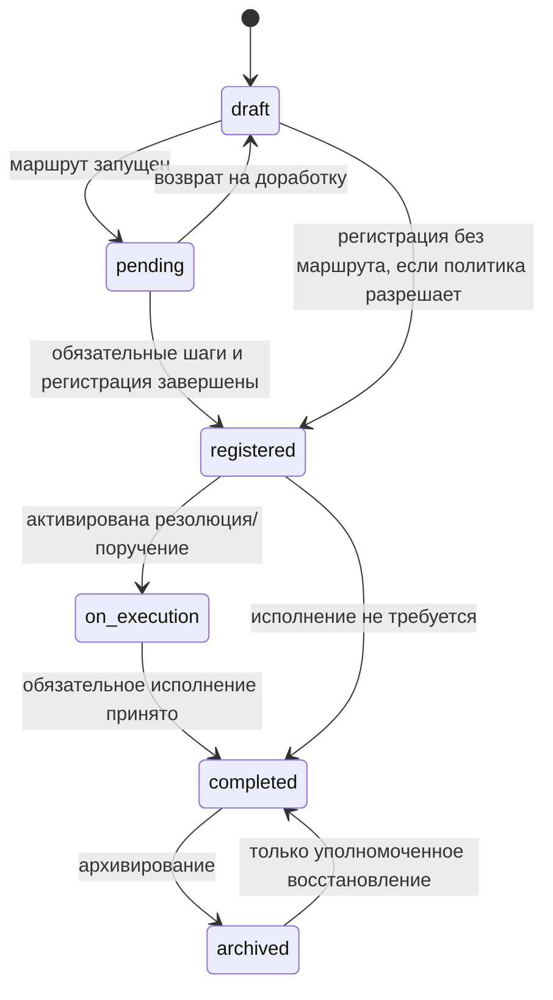
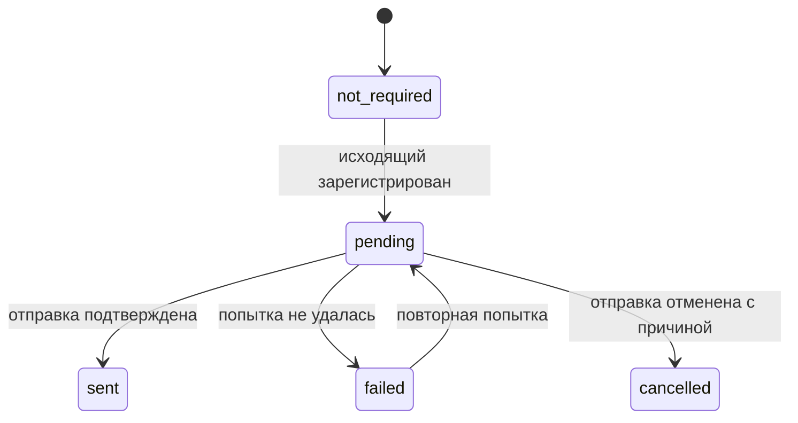
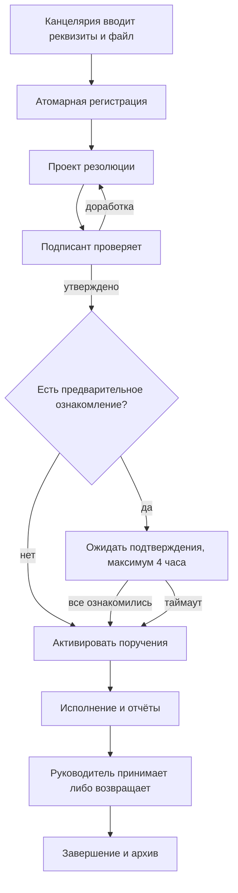
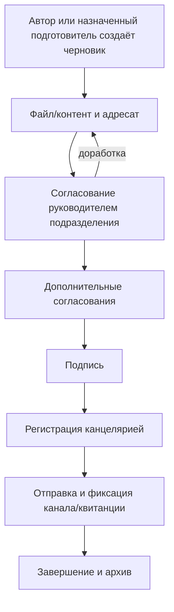

# СЭД CUKS — подробный план реализации

> Статус: готово к последовательной реализации.  
> Дата анализа: 2026-07-31.  
> Базовая ревизия проекта: `06a588e` (`main`).  
> Источник дополнительных требований: `ТЗ СЭД.pdf`, 26 страниц, SHA-256
> `A17499A1A88E311068C7CB9645A518C114EB0F010F7ACA0F6A13D1C606230E70`.

## 0. Назначение этого файла

Этот документ — исполнимый план развития уже существующего модуля документооборота CUKS
до полнофункциональной СЭД. Он предназначен прежде всего для ИИ-агента, который будет
реализовывать работу небольшими проверяемыми срезами.

Это **не план переписывания модуля с нуля**. Фаза 3 исходного `ROADMAP.md` уже реализовала
надёжную основу: документы, журналы, нумерацию, маршруты, резолюции, контроль, внутреннюю
ЭЦП, ознакомление, ДСП, замещения, аудит и связи с задачами. Дальнейшая работа должна
расширять существующие таблицы, сервисы, API и экраны без параллельной второй реализации.

После каждого завершённого среза агент обязан:

1. обновить этот файл: поставить выполненные чекбоксы и записать отклонения;
2. обновить `docs/plan/STATUS.md`;
3. обновить затронутые модульные спецификации;
4. сгенерировать новую миграцию, если менялась схема;
5. прогнать проверки конкретного пакета, затем полный quality gate;
6. сделать один или несколько маленьких Conventional Commit.

## 1. Обязательный порядок чтения для агента

Перед первой строкой кода прочитать полностью:

1. `AGENTS.md`;
2. `docs/plan/ROADMAP.md`;
3. `docs/plan/STATUS.md`;
4. этот файл;
5. `docs/modules/11-docflow.md`;
6. `docs/modules/12-files.md`;
7. `docs/modules/15-tasks.md`;
8. `docs/modules/16-admin.md`;
9. `docs/04-conventions.md`;
10. `docs/05-auth-rbac.md`;
11. `docs/06-design-system.md`;
12. `docs/07-data-model.md`;
13. `docs/09-security.md`.

Далее читать только относящиеся к текущему срезу файлы реализации и тесты. Перед
миграцией обязательно проверить фактический последний номер в
`packages/db/drizzle/`; номер из этого плана не копировать.

### 1.1. Приоритет требований

Если требования расходятся, использовать следующий порядок:

1. `AGENTS.md`, требования безопасности и архитектурные инварианты CUKS;
2. текущие фундаментальные документы CUKS;
3. `docs/modules/11-docflow.md` и смежные модульные спецификации;
4. адаптированные функциональные требования из `ТЗ СЭД.pdf`;
5. минимальное разумное решение, записанное в `STATUS.md`.

Внешнее ТЗ создано для другой организации. Его бизнес-возможности применимы к КЧС,
но названия ведомств, коммерческие условия, требования к поставщику и формулировки о
сертификации не переносятся в продукт буквально.

### 1.2. Неприкосновенные инварианты

- NestJS + Fastify, Drizzle ORM, PostgreSQL/PostGIS, Redis, Vite/React, Socket.IO,
  BullMQ, MinIO, pnpm/Turborepo.
- Никаких внешних SaaS, CDN, публичных тайлов, Google Fonts и обязательного доступа
  в интернет.
- Серверные сессии Redis и `httpOnly` cookie; JWT в `localStorage` запрещён.
- Права проверяются guard + CASL на сервере. Скрытие кнопки на клиенте не является
  защитой.
- UI — через i18next. Заполнить одинаковые ключи в `ru.json` и `tj.json`; до
  профессионального перевода таджикский ключ получает русский текст.
- UTC в БД, показ и календарная нумерация — `Asia/Dushanbe`.
- Пользовательские сущности удаляются мягко. Применённые миграции не редактировать.
- Денежные значения — `numeric`, не `float`.
- Внутренняя криптографическая подпись ECDSA остаётся юридически и технически
  значимой подписью CUKS.
- Новых `any`, `@ts-ignore` и безосновательных `eslint-disable` быть не должно.

## 2. Что изучено

### 2.1. Внешнее ТЗ

Все 26 страниц PDF прочитаны и визуально проверены. Документ требует:

- веб-СЭД минимум на 200 одновременно работающих пользователей;
- иерархические роли и организационную структуру;
- входящие, исходящие и внутренние документы;
- регистрацию, регистрационные журналы и шаблоны;
- последовательное/параллельное согласование, подпись и возврат на доработку;
- резолюции, поручения, ознакомление и контроль сроков;
- маршрутизацию исходящих ответов и фиксацию отправки;
- централизованный архив, версии, сроки хранения и поиск;
- расширенный поиск по реквизитам и содержимому;
- задачи, подзадачи, отчёты, календарь и уведомления;
- справочники, пользователей, блокировку, аудит и интеграции.

Требования страниц 24–26 о стаже поставщика, обучении, гарантийной поддержке,
ценовом предложении и оплате относятся к закупке/договору, а не к программной
реализации. Они не входят в этот backlog.

### 2.2. Текущая реализация

Основные точки расширения:

- схема: `packages/db/src/schema/docflow.ts`;
- DTO: `packages/shared/src/dto/docflow.ts`;
- API: `apps/api/src/modules/docflow/`;
- Web: `apps/web/src/features/docflow/`;
- очереди сроков: `apps/worker/src/queues/deadlines/`;
- переводы: `apps/web/src/locales/ru.json`, `apps/web/src/locales/tj.json`;
- Playwright: `apps/web/e2e/docflow-*.spec.ts`;
- существующие миграции СЭД: `packages/db/drizzle/0027_*`—`0036_*`;
- актуальный последний номер миграции на момент анализа — `0046`, но агент всегда
  обязан перепроверить его.

Уже реализовано и должно переиспользоваться:

- журналы и транзакционная безразрывная нумерация;
- входящие, исходящие и внутренние документы;
- карточка документа и история;
- версии файлов в файловой подсистеме и антивирусный контур;
- статусы `draft`, `pending`, `registered`, `on_execution`, `completed`,
  `archived`;
- маршруты, шаги и шаблоны маршрутов на API;
- резолюции, подрезолюции, отчёт, исполнение, продление, снятие с контроля;
- ознакомление;
- внутренняя ECDSA-подпись, проверка и экспорт подписанного PDF;
- режим ДСП, allow-list и журнал чтения ДСП;
- замещение и действия от имени замещаемого;
- связи документов, задачи по документу, контроль и отчёт исполнительской
  дисциплины;
- permissions, CASL, аудит, уведомления, Socket.IO и worker-инфраструктура.

## 3. Матрица покрытия требований

Обозначения:

- **Есть** — переиспользовать, не дублировать.
- **Частично** — расширить текущую реализацию.
- **Нет** — создать в рамках этого плана.
- **Не переносить** — конфликтует с CUKS или не является продуктовой функцией.

| Требование внешнего ТЗ | Страницы | Состояние CUKS | Решение |
| --- | ---: | --- | --- |
| Web UI, многопользовательская работа | 4–7 | Есть | Нагрузочно подтвердить 200 concurrent |
| Роли и оргструктура | 6–7, 22–24 | Есть | Сопоставить ролям CUKS через permissions/scopes |
| Главная страница с KPI СЭД | 6–7 | Частично | Добавить рабочий docflow-виджет и KPI |
| Входящая регистрация | 7–9 | Частично | Расширить реквизиты и сделать атомарной |
| Проект резолюции и утверждение подписантом | 7–9 | Нет | Ввести `resolution_proposals` |
| Ознакомление до передачи исполнителям, таймаут 4 часа | 8 | Нет | Ввести batch/gate и worker release |
| Несколько исполнителей | 8, 13, 16 | Есть | Сохранить co-executors; уточнить ответственность |
| Исходящий ответ на входящий | 9–12 | Частично | Создание ответа из карточки + типизированная связь |
| Согласование/подпись/регистрация исходящего | 9–12 | Частично | Полный route builder и преднастроенный workflow |
| Фиксация факта и канала отправки | 11 | Нет | Ввести `document_dispatches` |
| Внутренний rich-text документ | 12–14 | Нет | Ввести безопасный структурированный контент |
| Шаблоны документов | 11–13, 21 | Нет | Ввести версии шаблонов и генерацию черновика |
| Последовательные и параллельные маршруты | 5, 10, 13 | Частично | Backend есть; закончить UI и SLA шагов |
| Архив и сроки хранения | 14–15 | Частично | Ввести архивные метаданные, hold и disposition |
| Поиск по реквизитам и содержимому | 5, 12, 15 | Частично | PostgreSQL FTS + извлечённый текст файлов |
| Версионность | 5, 9, 12, 15 | Частично | Файлы есть; добавить версии контента/шаблонов |
| Комментарии к документам | 8–9 | Нет | Переиспользовать `app.comments` |
| Контроль поручений и отчёты | 15–17 | Есть | Расширить dashboard/фильтры/уведомления |
| Подзадачи и календарь | 17 | Частично | Развивать task-модуль, не дублировать в СЭД |
| Пользователи, блокировка, сброс пароля | 22–24 | Есть | Оставить текущую административную модель |
| Самовосстановление по email/SMS | 18, 24 | Не переносить | Изолированная сеть; только утверждённый канал |
| Изображение подписи | 18, 23 | Не переносить как подпись | ECDSA авторитетна; факсимиле только декоративно |
| No-code конструктор страниц портала | 5–7 | Не переносить | Отдельный CMS-продукт, не СЭД |
| Внешняя сертификация | 5, 15 | Нельзя определить | Нужен названный стандарт и орган сертификации |
| Коммерческие/квалификационные условия | 24–26 | Не переносить | Договорной контур |

## 4. Главные выявленные пробелы и приоритет

### P0 — исправить до расширения

1. Нумерация использует UTC-год/месяц, хотя бизнес-календарь — `Asia/Dushanbe`.
   На границе Нового года это может выдать номер не того периода.
2. Мастер регистрации создаёт и регистрирует документ несколькими запросами. При
   частичном сбое остаётся неожиданный черновик.
3. Документ прикрепляет узел из личного пространства без отдельного защищённого
   download/preview API СЭД и без гарантированного переноса в системное пространство.
4. UI предлагает `approve/reject` для шагов `sign` и `acknowledge`, хотя сервер
   корректно отвергает неправильное действие.
5. Шаги маршрута без исполнителя способны заблокировать маршрут.
6. Ручной переход статуса не везде доказывает завершённость обязательных шагов,
   резолюций и подписи.

### P1 — основная функциональность СЭД

1. Полная карточка и редактирование реквизитов.
2. Шаблоны документов.
3. Полный конструктор маршрута и шаблонов маршрутов.
4. Проект резолюции, утверждение подписантом и четырёхчасовой gate.
5. Исходящий ответ и журнал отправки.
6. Расширенный полнотекстовый поиск.
7. Архив, сроки хранения, legal hold и управляемое выбытие.
8. Комментарии, события, уведомления и dashboard.

### P2 — зрелость и интеграции

1. Внутренний структурированный редактор.
2. Адаптеры внутренних корпоративных систем.
3. Сохранённые поиски, экспорт подборок и дополнительные отчёты.
4. Расширенные SLA, делегирование по должности/подразделению и массовые операции.

## 5. Целевая модель СЭД

### 5.1. Роли внешнего ТЗ в терминах CUKS

Не создавать проверки вида `if role === "director"` в бизнес-сервисах. Использовать
permissions и область оргструктуры.

| Роль из ТЗ | Представление в CUKS | Основные permissions |
| --- | --- | --- |
| Администратор | `superadmin` / platform admin | настройки, справочники, пользователи |
| Директор | руководитель глобального scope | подпись, утверждение резолюций, контроль |
| Заместитель | руководитель + substitution | те же действия в разрешённом scope |
| Общий отдел/канцелярия | clerk/registrar | регистрация, отправка, архив |
| Начальник управления | руководитель ветки оргструктуры | согласование, поручения, контроль ветки |
| Начальник отдела | руководитель подразделения | то же в меньшем scope |
| Сотрудник | employee | черновики, исполнение, ознакомление |

Права, которые потребуются дополнительно или должны быть проверены:

- `docflow.document.create`;
- `docflow.document.read`;
- `docflow.document.update`;
- `docflow.document.register`;
- `docflow.document.dispatch`;
- `docflow.document.archive`;
- `docflow.document.dispose`;
- `docflow.route.manage`;
- `docflow.route.act`;
- `docflow.resolution.propose`;
- `docflow.resolution.approve`;
- `docflow.resolution.execute`;
- `docflow.template.manage`;
- `docflow.archive.hold`;
- `docflow.report.read`;
- `docflow.dsp.read`.

Если эквивалент уже существует — использовать его и обновить документацию, а не
создавать почти одинаковое право.

### 5.2. Жизненный цикл документа

Сохраняется существующий основной автомат состояний:



Отправка не должна превращаться в неоднозначный статус документа `sent`. Это
отдельный процесс с собственной историей:



Переходы выполняет один `DocumentWorkflowPolicy`/state-machine service. Контроллеры
не меняют статус напрямую. Любой переход:

- проверяет permission и видимость;
- блокирует строку документа при гонке;
- проверяет обязательные шаги, подписи, регистрацию и активные резолюции;
- пишет audit в той же транзакции или через надёжный transactional outbox;
- публикует событие только после commit.

### 5.3. Входящий процесс



Правила:

- зарегистрировать входящий может только разрешённая роль канцелярии;
- номер создаётся атомарно с документом;
- подписант — один пользователь на проект резолюции;
- исполнители могут быть из разных подразделений;
- ответственный исполнитель один, соисполнителей несколько;
- таймаут 4 часа задаётся системной настройкой, default `PT4H`;
- раннее ознакомление всех участников немедленно открывает поручения;
- истечение таймаута не считается ознакомлением: ожидающие получают `expired`,
  а исполнители — доступ;
- все решения и действия видны в единой истории.

### 5.4. Исходящий процесс



Исходящий ответ создаётся из входящего документа одной командой. Команда:

- создаёт черновик исходящего;
- копирует безопасные реквизиты корреспондента;
- создаёт типизированную связь `response_to`;
- при необходимости связывает с резолюцией;
- назначает автора/подготовителя;
- не копирует ДСП-доступ автоматически шире исходного документа.

### 5.5. Внутренний процесс

Внутренний документ использует те же файлы, маршруты, подпись, ознакомление,
резолюции и архив. Его отличия:

- нет внешнего корреспондента и dispatch;
- может иметь структурированный внутренний контент;
- распространение возможно пользователям, должностям и подразделениям;
- шаблон маршрута выбирается по типу: приказ, протокол, служебная записка и т. п.

## 6. Изменения модели данных

Названия ниже являются целевыми. Перед реализацией сверить конвенции существующей
схемы. Все FK, timestamps, soft-delete и audit-поля должны соответствовать
`docs/07-data-model.md`.

### 6.1. Расширение `documents`

Добавить, если аналога нет:

- `content_json jsonb` — безопасный структурированный контент;
- `content_text text` — нормализованный текст для поиска;
- `sender_name text` — snapshot отправителя входящего;
- `sender_contact text` — snapshot контакта;
- `recipient_name text` — snapshot адресата исходящего;
- `recipient_contact text` — snapshot контакта;
- `response_due_at timestamptz`;
- `archived_at timestamptz`;
- `archived_by uuid`;
- `retention_until date`;
- `legal_hold boolean not null default false`;
- `legal_hold_reason text`;
- `legal_hold_set_by uuid`;
- `legal_hold_set_at timestamptz`;
- `disposition_status` — `active|candidate|approved|rejected|disposed`;
- `disposed_at timestamptz`;
- `disposed_by uuid`;
- `search_vector tsvector` либо эквивалентный generated/maintained column.

Ограничения:

- `legal_hold = true` запрещает disposition;
- `archived_at` требуется при статусе `archived`;
- `disposed_at` допускается только после утверждённого disposition;
- физически удалять документ автоматически нельзя;
- snapshot-поля не заменяют ссылку на справочник корреспондентов.

Индексы:

- GIN по `search_vector`;
- `(status, archived_at)`;
- `(document_class, registration_date desc)`;
- `(correspondent_id, registration_date desc)`;
- `(retention_until, disposition_status)` partial для архива;
- существующие индексы видимости/ДСП сохранить и проверить `EXPLAIN`.

### 6.2. `document_collaborators`

Назначение: подготовитель/редактор документа без подмены автора.

Поля:

- `id`, `document_id`, `user_id`;
- `role`: `editor|viewer|preparer`;
- `assigned_by`, `created_at`, `deleted_at`.

Уникальный partial index на активную пару `(document_id, user_id, role)`.

Правила:

- author остаётся владельцем;
- `preparer` и `editor` меняют только разрешённый черновик;
- активный исполнитель route-step может редактировать лишь при явной policy;
- collaborator никогда не обходит DSP allow-list;
- изменение состава пишется в audit.

### 6.3. `document_templates` и `document_template_versions`

`document_templates`:

- `id`, `name`, `code`, `document_class`, `document_type_code`;
- `org_unit_id` nullable для глобального шаблона;
- `route_template_id` nullable;
- `is_active`, `created_by`, `updated_by`, timestamps, `deleted_at`.

`document_template_versions`:

- `id`, `template_id`, `version`;
- `content_json`, `content_text`;
- `file_node_id` nullable для DOCX/PDF-основы;
- `variables_schema jsonb`;
- `created_by`, `created_at`, `published_at`.

Ограничения:

- опубликованная версия неизменяема;
- уникальность `(template_id, version)`;
- новый документ сохраняет `template_version_id`, чтобы результат был
  воспроизводим;
- переменные берутся из allow-list (`document.*`, `author.*`, `org.*`,
  `correspondent.*`), произвольный код запрещён.

### 6.4. `resolution_types`

Если справочники CUKS централизованы, реализовать как typed dictionary, но сохранить
следующие метаданные:

- `code`, `name_ru`, `name_tj`;
- `action_kind`: `execute|acknowledge|reply|review`;
- `requires_due_at`;
- `requires_executor`;
- `requires_outgoing_response`;
- `default_control`;
- `default_due_duration` nullable;
- `is_active`, `sort_order`.

Изменения типов резолюций аудируются. Удаление используемого типа — только
деактивация.

### 6.5. `resolution_proposals`

Проект утверждаемой резолюции не смешивать со статусом исполнения существующей
`resolutions`.

Поля:

- `id`, `document_id`, `resolution_type_id`;
- `text`, `signer_id`;
- `responsible_executor_id`;
- `co_executor_ids uuid[]` либо нормализованная таблица, в соответствии с текущей
  моделью;
- `acquaint_user_ids uuid[]` и/или отдельные target rows;
- `due_at`, `is_control`;
- `status`: `draft|pending|approved|rejected|cancelled`;
- `proposed_by`, `submitted_at`;
- `decided_by`, `decided_at`, `decision_comment`;
- `resolution_id` nullable;
- timestamps, `deleted_at`.

Утверждение в одной транзакции:

1. блокирует proposal;
2. доказывает, что actor — актуальный signer или разрешённый заместитель;
3. создаёт существующую `resolution`;
4. создаёт batch ознакомления при необходимости;
5. задаёт `available_at` резолюции;
6. меняет статус документа на `on_execution` по policy;
7. пишет audit и outbox.

### 6.6. `acquaintance_batches` и расширение `acquaintances`

`acquaintance_batches`:

- `id`, `document_id`, `resolution_id` nullable, `route_step_id` nullable;
- `kind`: `route|pre_execution|distribution`;
- `release_at timestamptz` nullable;
- `released_at`, `released_reason`: `all_acknowledged|timeout|manual`;
- `created_by`, timestamps.

`acquaintances` расширить:

- `batch_id`;
- `status`: `pending|acknowledged|expired|cancelled`;
- `notified_at`, `acknowledged_at`.

`resolutions` расширить:

- `available_at timestamptz` nullable;
- `accepted_at`, `accepted_by` при явной приёмке результата;
- `returned_at`, `return_comment`.

Worker:

- идемпотентно выбирает невыпущенные batch с `release_at <= now()`;
- использует `FOR UPDATE SKIP LOCKED`;
- помечает оставшиеся acquaintance как `expired`;
- выставляет `available_at = now()` у резолюции;
- создаёт уведомления исполнителям и audit;
- повторный запуск не дублирует эффекты.

### 6.7. Расширение `route_steps`

Добавить:

- `activated_at timestamptz`;
- `due_at timestamptz`;
- `completed_at timestamptz`;
- `assignee_kind`: `user|position|org_unit`;
- `assignee_position_id` nullable;
- `assignee_org_unit_id` nullable;
- `resolution_strategy`: `snapshot|dynamic`.

Правила:

- при `snapshot` пользователи вычисляются при старте маршрута;
- `dynamic` допустим только там, где смена должности должна менять адресата;
- активированный step всегда имеет хотя бы одного действующего actor;
- `due_at = activated_at + dueHours`;
- parallel steps имеют одинаковый `order`;
- следующий order активируется только после успешного завершения всех обязательных
  steps текущего order;
- действия строго соответствуют `kind`:
  `approve` → approve/reject, `sign` → sign, `acknowledge` → acknowledge,
  `register` → register, `execute` → complete/report.

### 6.8. `document_dispatches`

Поля:

- `id`, `document_id`;
- `channel`: `courier|postal|email|integration|hand_delivery|other`;
- `status`: `pending|sent|failed|cancelled`;
- `recipient_name`, `recipient_address`, `recipient_contact`;
- `external_reference`;
- `receipt_file_node_id`;
- `attempted_at`, `sent_at`;
- `created_by`, `confirmed_by`;
- `failure_code`, `failure_message`;
- timestamps, `deleted_at`.

Каждая попытка — отдельная строка либо отдельный child `dispatch_attempts`. Не
перезаписывать ошибку успешной попыткой. Для email/integration хранить техническую
квитанцию без секретов.

Индексы:

- `(document_id, created_at desc)`;
- `(status, attempted_at)`;
- уникальность `external_reference` в границах интеграции, если она гарантирована.

### 6.9. Архив и номенклатура

Расширить `nomenclature`:

- `retention_months integer` nullable;
- `is_permanent boolean`;
- `archive_org_unit_id`;
- `disposition_requires_approval boolean default true`.

При архивировании документ получает snapshot рассчитанного `retention_until`.
Позднейшее изменение справочника не меняет существующий срок автоматически.

Если нужен формальный акт выбытия, добавить:

`archive_disposition_batches`:

- `id`, `number`, `status draft|pending|approved|rejected|executed`;
- `reason`, `created_by`, `approved_by`, timestamps.

`archive_disposition_items`:

- `batch_id`, `document_id`, `decision`, `comment`.

Автоматически worker только формирует кандидатов. Утверждение и фактическое
необратимое удаление — разные действия. На первом этапе `executed` означает
криптографически/аудитно зафиксированное логическое выбытие; физическое очищение
MinIO включать только после утверждённой retention policy.

### 6.10. Комментарии

Переиспользовать `app.comments` с `entity_type = document`. Не создавать
`document_comments`, если общая таблица удовлетворяет модели.

Требуется:

- visibility document policy на list/create/update/delete;
- упоминания пользователей;
- soft-delete;
- attachments через file nodes с той же document access policy;
- события комментариев в общей timeline.

### 6.11. Поисковый индекс

В поисковый документ включить:

- регистрационный номер;
- тему и краткое содержание;
- безопасные реквизиты отправителя/получателя;
- `content_text`;
- имена корреспондента и автора;
- извлечённый текст актуальных доступных file versions.

Реализация:

- PostgreSQL `websearch_to_tsquery('russian', :q)`;
- GIN для собственных полей документа;
- `EXISTS` по уже существующему индексу извлечённого текста файлов;
- trigram только для номера/коротких имён, если он уже одобрен стеком;
- обязательный фильтр visibility/DSP применяется внутри SQL, а не после выдачи;
- snippets не должны раскрывать текст документа, к которому нет доступа.

## 7. API-контракт

Все входы — Zod DTO из `packages/shared`, все новые endpoint видны в Swagger.
Ошибки используют общий envelope и стабильные коды.

### 7.1. Документы и карточка

Расширить:

- `POST /docflow/documents` — создание полного черновика;
- `PATCH /docflow/documents/:id` — реквизиты и content с optimistic version;
- `GET /docflow/documents/:id` — полный detail;
- `GET /docflow/documents` — расширенные filters/sort;
- `POST /docflow/documents/register-incoming` — атомарное создание и регистрация;
- `POST /docflow/documents/:id/actions/create-response`;
- `POST /docflow/documents/:id/actions/archive`;
- `POST /docflow/documents/:id/actions/restore`;
- `GET /docflow/documents/:id/timeline`.

`register-incoming` принимает idempotency key. Повтор с тем же ключом возвращает тот
же документ/номер, а не создаёт новый.

### 7.2. Файлы документа

Добавить:

- `POST /docflow/documents/:id/files` — attach из staging с server-side
  copy/move в system space;
- `GET /docflow/documents/:id/files/:fileId/download`;
- `GET /docflow/documents/:id/files/:fileId/preview`;
- `POST /docflow/documents/:id/files/:fileId/actions/set-main`;
- `DELETE /docflow/documents/:id/files/:fileId` — только допустимый soft unlink.

Каждый read:

- загружает документ;
- применяет document visibility и DSP;
- проверяет AV status;
- запрещает заражённую/карантинную версию;
- логирует чтение по действующей security policy;
- не выдаёт прямой бессрочный MinIO URL.

### 7.3. Collaborators

- `GET /docflow/documents/:id/collaborators`;
- `POST /docflow/documents/:id/collaborators`;
- `DELETE /docflow/documents/:id/collaborators/:collaboratorId`.

### 7.4. Шаблоны документов

- `GET /docflow/document-templates`;
- `POST /docflow/document-templates`;
- `GET /docflow/document-templates/:id`;
- `PATCH /docflow/document-templates/:id`;
- `POST /docflow/document-templates/:id/versions`;
- `POST /docflow/document-templates/:id/versions/:version/actions/publish`;
- `POST /docflow/document-templates/:id/actions/deactivate`;
- `POST /docflow/document-templates/:id/actions/instantiate`.

### 7.5. Маршруты

Сохранить существующие endpoint, добавить/уточнить:

- dry-run/validation перед стартом;
- запуск по `routeTemplateId` с разрешёнными overrides;
- `POST /docflow/route-steps/:id/actions/complete` для `execute`;
- регистрация через существующее действие документа завершает только активный
  `register` step;
- sign endpoint завершает только активный `sign` step;
- acknowledge endpoint завершает только активный `acknowledge` step;
- endpoint списка доступных actors по user/position/org unit;
- cloning/versioning route template вместо изменения активной схемы «на лету».

### 7.6. Проекты резолюций

- `GET /docflow/documents/:id/resolution-proposals`;
- `POST /docflow/documents/:id/resolution-proposals`;
- `PATCH /docflow/resolution-proposals/:id`;
- `POST /docflow/resolution-proposals/:id/actions/submit`;
- `POST /docflow/resolution-proposals/:id/actions/approve`;
- `POST /docflow/resolution-proposals/:id/actions/reject`;
- `POST /docflow/resolution-proposals/:id/actions/cancel`;
- CRUD/deactivate для resolution types в настройках.

Для `approve/reject` поддержать substitution и записать `acted_by/acted_for`.

### 7.7. Отправка

- `GET /docflow/documents/:id/dispatches`;
- `POST /docflow/documents/:id/dispatches`;
- `POST /docflow/dispatches/:id/actions/confirm`;
- `POST /docflow/dispatches/:id/actions/fail`;
- `POST /docflow/dispatches/:id/actions/cancel`;
- `POST /docflow/dispatches/:id/actions/retry`.

В первом релизе ручные каналы полностью рабочие. `email` и `integration` включаются
только при наличии локально настроенного адаптера.

### 7.8. Архив и поиск

- `GET /docflow/archive`;
- `POST /docflow/documents/:id/actions/legal-hold`;
- `DELETE /docflow/documents/:id/legal-hold`;
- `GET /docflow/archive/disposition-candidates`;
- CRUD/actions disposition batch;
- `GET /docflow/search` с безопасными filter/sort;
- CRUD `/docflow/saved-searches`, если общая система сохранённых представлений не
  подходит.

### 7.9. Стабильные error codes

Минимальный набор:

- `DOCFLOW_DOCUMENT_NOT_EDITABLE`;
- `DOCFLOW_INVALID_STATUS_TRANSITION`;
- `DOCFLOW_REGISTRATION_PERIOD_MISMATCH`;
- `DOCFLOW_ROUTE_HAS_NO_ASSIGNEE`;
- `DOCFLOW_ROUTE_ACTION_KIND_MISMATCH`;
- `DOCFLOW_REQUIRED_SIGNATURE_MISSING`;
- `DOCFLOW_REQUIRED_RESOLUTION_OPEN`;
- `DOCFLOW_FILE_NOT_SAFE`;
- `DOCFLOW_FILE_ACCESS_DENIED`;
- `DOCFLOW_PROPOSAL_NOT_PENDING`;
- `DOCFLOW_PROPOSAL_SIGNER_MISMATCH`;
- `DOCFLOW_ACQUAINTANCE_ALREADY_RELEASED`;
- `DOCFLOW_DISPATCH_NOT_ALLOWED`;
- `DOCFLOW_ARCHIVE_RETENTION_ACTIVE`;
- `DOCFLOW_ARCHIVE_LEGAL_HOLD`;
- `DOCFLOW_IDEMPOTENCY_CONFLICT`.

Не возвращать пользователю внутренний SQL, bucket key, стек или персональные данные
других пользователей.

## 8. UI/UX

Все крупные списки: skeleton, empty state с действием, error state с retry. Все
формы: видимые labels, keyboard navigation, focus management, server error summary,
защита от потери несохранённых данных. Проверить светлую и тёмную тему.

### 8.1. Реестр документов

Расширить `DocumentsPage`:

- очереди: входящие на регистрацию, мои черновики, на согласовании, на подписи,
  на ознакомлении, на исполнении, ожидают отправки, просроченные, архив;
- фильтры: класс, тип, статус, журнал, номер, период, корреспондент, автор,
  подразделение, исполнитель, контроль, срок, ДСП, наличие подписи, канал отправки;
- chips активных фильтров и «Сбросить»;
- server-side sort по allow-list;
- сохранённые представления;
- compact DataTable с доступным названием документа;
- bulk actions только там, где сервер поддерживает атомарную/частично успешную
  семантику.

### 8.2. Создание и регистрация входящего

Заменить многошаговую неатомарную логику на один wizard:

1. источник: корреспондент, отправитель, контакт, входящий номер/дата;
2. регистрация: журнал, тип, тема, summary, срок ответа;
3. файл: upload, AV status, выбор основного файла;
4. доступ: обычный/ДСП и allow-list;
5. проверка;
6. одна команда `register-incoming`.

Если вкладка закрыта до submit — серверного документа нет. Если upload уже выполнен
в staging, retention job удаляет orphan после установленного TTL.

### 8.3. Карточка документа

Сохранить текущую страницу, довести до следующих областей:

- header: номер, status badge, class/type, срок, контроль, ДСП;
- action bar зависит от вычисленных сервером `availableActions`;
- tabs:
  `overview`, `content`, `files`, `route`, `resolutions`, `distribution/dispatch`,
  `links`, `tasks`, `comments`, `history`;
- inline PDF preview основного файла;
- список версий и безопасное скачивание;
- редактирование реквизитов только в разрешённых статусах;
- collaborators;
- создание ответа;
- единая timeline: изменения, route actions, подписи, резолюции, файлы,
  комментарии, отправка, архив;
- никаких кнопок действия для несовместимого kind шага.

### 8.4. Route builder

Нужен рабочий визуальный конструктор, не JSON-поле:

- выбор существующего route template;
- последовательные группы, внутри группы — parallel steps;
- kind шага;
- actor: пользователь, должность, подразделение;
- SLA/dueHours;
- обязательность;
- drag/reorder с доступной клавиатурной альтернативой;
- validation summary до старта;
- preview фактически разрешённых actors;
- запрет старта, если actor не определён.

На карточке показать:

- текущую группу;
- статусы всех parallel steps;
- actor и substitution;
- activated/due/completed;
- решение и comment;
- overdue marker;
- только релевантное действие.

### 8.5. Резолюция

UI proposal:

- тип резолюции;
- текст;
- подписант;
- ответственный;
- соисполнители;
- предварительно знакомящиеся;
- срок и контроль;
- предупреждение о четырёхчасовом gate;
- draft/save/submit.

UI подписанта:

- документ и основной файл рядом с проектом;
- approve;
- reject с обязательным комментарием;
- edit допустимых полей, если policy это разрешает;
- видимое действие через substitution.

После approve:

- countdown gate;
- список acknowledged/pending/expired;
- исполнители видят поручение только после release;
- reason release отображается в timeline.

### 8.6. Исходящий и отправка

- «Создать ответ» из карточки входящего;
- адресат и контакт предварительно заполнены, но редактируемы;
- relation banner со ссылкой на исходный входящий;
- preparer/collaborators;
- выбранный route template;
- после регистрации — панель отправки;
- ручные каналы: дата, адресат, reference, квитанция;
- failed/retry для интеграционного канала;
- журнал всех попыток.

### 8.7. Архив

Отдельный `ArchivePage`:

- быстрый и расширенный поиск;
- retention badges;
- legal hold;
- кандидаты к выбытию;
- просмотр номенклатурного дела;
- восстановление при наличии permission;
- disposition batches и двойное подтверждение необратимого действия;
- экспорт описи без раскрытия недоступных документов.

### 8.8. Dashboard и глобальный поиск

Заменить placeholder `AttentionWidget` реальными данными:

- на согласовании;
- на подписи;
- на ознакомлении;
- мои поручения;
- просрочено;
- ожидают отправки;
- новые входящие;
- архивные кандидаты только для архивариуса.

Глобальный `Cmd+K` возвращает максимум 5 видимых документов с номером, темой,
типом и status. Search provider использует тот же серверный visibility policy.

## 9. Уведомления, realtime и аудит

### 9.1. События

Определить typed domain events:

- `docflow.document.created`;
- `docflow.document.registered`;
- `docflow.document.updated`;
- `docflow.document.response_created`;
- `docflow.file.attached`;
- `docflow.route.started`;
- `docflow.route.step_activated`;
- `docflow.route.step_due_soon`;
- `docflow.route.step_overdue`;
- `docflow.route.step_completed`;
- `docflow.route.returned`;
- `docflow.resolution_proposal.submitted`;
- `docflow.resolution_proposal.approved`;
- `docflow.resolution_proposal.rejected`;
- `docflow.acquaintance.assigned`;
- `docflow.acquaintance.released`;
- `docflow.resolution.assigned`;
- `docflow.resolution.reported`;
- `docflow.resolution.completed`;
- `docflow.dispatch.failed`;
- `docflow.dispatch.sent`;
- `docflow.archive.candidate`;
- `docflow.archive.legal_hold_set`;
- `docflow.archive.disposed`.

Event payload содержит id и безопасный минимум. Полная карточка перечитывается API.
Не помещать текст ДСП документа в Socket.IO payload.

### 9.2. Уведомления

Для каждого события определить:

- получателей с учётом актуальной org scope и substitution;
- in-app title/body через i18n key;
- deep link;
- deduplication key;
- канал, разрешённый настройками пользователя;
- retry policy.

Минимум уведомлять:

- нового actor активного route step;
- подписанта проекта резолюции;
- знакомящегося;
- исполнителя после release;
- автора при возврате;
- ответственного о приближении/нарушении срока;
- канцелярию о готовности к регистрации/отправке;
- автора/канцелярию об ошибке dispatch.

### 9.3. Audit matrix

Каждое значимое действие:

| Действие | Audit action | Обязательные metadata |
| --- | --- | --- |
| Создание/редактирование | `document.create/update` | document id, changed fields |
| Регистрация | `document.register` | journal, number, period |
| Изменение доступа | `document.access_update` | old/new confidentiality, user ids |
| Чтение ДСП/файла | `document.read` / `file.download` | document, file, version |
| Route start/action | `route.start/step_action` | step kind, actor, acted_for |
| Proposal decision | `resolution_proposal.*` | signer, result, resolution id |
| Gate release | `acquaintance.release` | reason, pending count |
| Подпись | существующее событие | cert, hash, acted_for |
| Отправка | `dispatch.*` | channel, status, reference |
| Архив/hold/disposition | `archive.*` | retention, reason, approver |
| Шаблон | `document_template.*` | template/version |

Секреты, полный content, бинарные данные и персональные контакты в metadata не писать.

## 10. Детальный порядок реализации

Каждый этап ниже — отдельный deliverable. Не начинать следующий, пока предыдущий не
зелёный и не отражён в `STATUS.md`.

### Этап 0. Зафиксировать контракт и baseline

Цель: превратить этот план в согласованный проектный backlog, не меняя runtime.

Задачи:

- [x] Добавить в `ROADMAP.md` отдельный track «СЭД 2.0», не переоткрывая фазу 3.
- [x] Обновить `docs/modules/11-docflow.md`: целевые процессы, статусы и права.
- [x] Зафиксировать роль канцелярии и подписанта через permissions.
- [~] Согласовать перечень типов документов и стартовые route templates. — до ответа
  заказчика действует default §15: справочник видов документов и шаблоны маршрутов
  берутся из действующих сидов CUKS (`packages/db/src/seed.ts`), новые не выдумываются.
- [~] Согласовать, нужен ли фактический локальный SMTP/иной внутренний транспорт. —
  **optional**, не блокирует. Default: ручная фиксация отправки; адаптеры email/integration
  выключены до названного внутреннего сервера.
- [~] Согласовать юридическое значение внутренней ECDSA и требования к внешней
  сертификации. Без названного стандарта не обещать «сертифицированность». — вопрос
  открыт для заказчика; в спеке и UI формулировка «сертифицированность» не используется.
- [ ] Составить data inventory текущей production/dev БД перед backfill. — переносится
  в первый этап со схемными изменениями (2); на этапе 1A backfill не требуется.

Результат (2026-07-31):

- нет противоречий между roadmap, модульной спекой и этим планом: трек «СЭД 2.0» добавлен
  в `ROADMAP.md` отдельным разделом (фаза 3 не переоткрыта), `docs/modules/11-docflow.md`
  получил §2 (роли ТЗ → permissions), §3 (душанбинский календарь нумерации) и §12
  (целевая модель + безопасные defaults §15);
- неясные внешние интеграции помечены optional (этап 10, SMTP/ведомственный транспорт,
  внешняя сертификация) и не блокируют остальные этапы;
- код не менялся.

Проверки: markdown links, terminology и ручное ревью.

Предлагаемый commit:
`docs(docflow): define sed 2.0 implementation contract`.

### Этап 1. P0 — безопасность и целостность текущей основы

#### 1A. Календарная нумерация — **готово (2026-07-31)**

- [x] Вынести получение бизнес-года/месяца в общий timezone helper. —
  `packages/shared/src/time/index.ts`: `businessDateParts()`/`businessYear()` через
  `Intl` + tz-база, `dushanbeDayNumber()`/`DUSHANBE_UTC_OFFSET_MS` как быстрый путь;
  `enums/index.ts` (`deadlineDaysLeft`) переиспользует helper вместо своей копии смещения.
- [x] Использовать `Asia/Dushanbe` в `DocflowNumberingService`. — бакет счётчика и
  токены `{YYYY}/{YY}/{MM}` берутся из местной гражданской даты, `reg_date` остаётся UTC.
- [x] Unit-тесты: `2026-12-31T19:30:00Z` уже 2027 год в Душанбе. — плюс контрольная
  точка `18:59:59.999Z`, которая должна остаться в 2026.
- [x] Unit-тесты: начало/конец месяца и leap year. — граница месяца 31.03 в 19:00Z,
  високосное 29.02.2024 и невисокосный февраль 2027.
- [x] Concurrency test не менее 50 параллельных регистраций. — unit: 50 одновременных
  `allocate()` дают уникальную безразрывную последовательность 1…50 в одном
  периодном бакете, ровно один counter-statement на номер. Реальная сериализация на
  PostgreSQL закрыта e2e `apps/web/e2e/docflow-acceptance.spec.ts` (требует инфраструктуру).
- [x] Не менять уже выданные номера. — правка влияет только на будущие аллокации;
  миграция и backfill не требуются.

#### 1B. Атомарная входящая регистрация — **готово (2026-07-31), кроме прогона e2e**

- [x] Новый Zod DTO и idempotency key. — `registerIncomingSchema` в
  `packages/shared/src/dto/docflow.ts`; ключ хранится в `documents.registration_key`
  (миграция `0047_small_silvermane`, nullable + частичный unique index).
- [x] Одна DB transaction: document + counter + registration + file links + audit. —
  `DocumentsService.registerIncoming()`; audit пишется внутри транзакции новым
  `AuditService.logWithin(tx, event)`.
- [x] Повтор команды возвращает исходный результат. — предварительный поиск по ключу
  плюс перехват 23505 на гонке двух одновременных повторов; чужой ключ даёт
  `docflow.document.idempotency_conflict`.
- [x] Ошибка любого шага не расходует номер и не оставляет документ. — инкремент
  счётчика откатывается вместе с транзакцией; несуществующий файл отсекается до её
  открытия (400).
- [x] Перевести `RegisterWizard` на новую команду. — вместо create → attach → register
  один `POST /docflow/documents/register-incoming`; ключ создаётся один раз на монтирование
  и **не пересоздаётся** после ошибки, поэтому повторное нажатие безопасно.
- [~] E2E на сетевой retry после успешного commit. — спека написана
  (`apps/web/e2e/docflow-register-incoming.spec.ts`: атомарность, повтор ключа, сбой без
  расхода номера, чужой класс журнала, отказ без права), **но не прогнана**: на машине не
  запущен Docker, инфраструктура и браузеры Playwright недоступны. Прогнать вместе с
  `pnpm db:migrate` при поднятой инфраструктуре.

#### 1C. Защищённые файлы СЭД — **готово (2026-07-31), кроме прогона e2e/backfill**

- [x] Ввести `DocflowFilesService`. —
  `apps/api/src/modules/docflow/docflow-files.service.ts`: усыновление узла
  (`adoptDocumentFile`, чистая функция на `tx` — поэтому DI-цикла с `DocumentsService`
  нет), гейт `assertVersionServable` и защищённые `downloadUrl`/`previewUrl`.
- [x] Attach переносит/copy в system space server-side. — оба пути прикрепления
  (`addFile` и `register-incoming`) переносят узел в `system/docflow/<documentId>/`,
  обнуляя владельца; папки создаются лениво под advisory-lock. Идемпотентно.
- [x] Download/preview endpoint применяет visibility, DSP и AV. —
  `GET /docflow/documents/:id/files/:fileId/{download,preview}`: `assertVisible` (404 без
  утечки существования) → связь файла именно с этим документом → AV → короткоживущий
  presigned URL. Audit на каждую выдачу, ДСП дополнительно в read_log.
- [x] Существующие личные ссылки мигрировать/backfill безопасно и идемпотентно. —
  `pnpm --filter @cuks/db backfill:docflow-files [-- --dry-run] [-- --batch=N]`
  (`packages/db/src/scripts/backfill-docflow-files.ts`): коммит по одному документу,
  повторный запуск — no-op, прерванный запуск возобновляется простым перезапуском.
  **Не запускался** — нет поднятой БД.
- [x] Сделать файлы карточки кликабельными; основной PDF — inline preview. —
  `DocumentFilesSection` (имя, размер, AV-бейдж, кнопка скачивания); текущий основной
  PDF рендерится инлайн. `PdfViewer` расцеплен с `FsNodeDto` (принимает `src`), чтобы его
  можно было переиспользовать с document-gated URL. i18n RU/TJ добавлены.
- [~] Тесты deny для чужого документа, DSP без allow-list и quarantine. — unit на AV-гейт
  (4) и на UI-гейт (7) зелёные; e2e `apps/web/e2e/docflow-files.spec.ts` (усыновление,
  карантин, чужой документ, чужой fileId, ДСП) **написан, но не прогнан** — Docker не
  запущен.

#### 1D. Инварианты маршрутов и статусов — **готово (2026-07-31), кроме прогона e2e**

- [x] Server validation запрещает route step без разрешаемого actor. —
  `assertStepsHaveActors` до первой записи; `resolveAssigneeUsers` теперь считает только
  действующих пользователей (не `blocked`, не удалённых). Ошибка
  `docflow.route.step_has_no_assignee` (422), маршрут не создаётся.
- [x] UI показывает действие по kind. — `routeStepRowAction` из общей таблицы; строки
  `sign`/`acknowledge`/`register` показывают подсказку, где шаг завершается, вместо
  неработающей кнопки. `reject` доступен везде.
- [x] `sign` завершается только signature action. — через общую таблицу
  `ROUTE_STEP_KIND_ACTIONS` (прежний частный guard заменён).
- [x] `acknowledge` завершается только acknowledge action. — там же.
- [x] Определить и реализовать completion для `register` и `execute`. — `register`
  закрывается регистрацией документа в той же транзакции, что и выдача номера
  (`completeRegisterStep`); `execute` — новым
  `POST /docflow/route-steps/:id/actions/complete`.
- [x] Central workflow policy запрещает `completed/archived` при открытых
  обязательных действиях. — `assertNoOpenObligations` (чистая) поверх счётчиков,
  прочитанных под тем же row lock: `route_open` / `resolution_open` /
  `acquaintance_open`. Попутно исправлено: завершение маршрута больше не откатывает
  уже зарегистрированный документ в `pending_registration`.
- [~] Regression tests всех допустимых и запрещённых переходов. — unit: полная матрица
  вид × действие (8 кейсов) и политика закрытия (6 кейсов); web: действия по kind
  (4 кейса). E2E `apps/web/e2e/docflow-route-invariants.spec.ts` **написан, но не
  прогнан** — Docker не запущен.

Файлы:

- `packages/shared/src/dto/docflow.ts`;
- `packages/db/src/schema/docflow.ts` при необходимости;
- `apps/api/src/modules/docflow/docflow-numbering.service.ts`;
- `apps/api/src/modules/docflow/documents.service.ts`;
- `apps/api/src/modules/docflow/routes.service.ts`;
- controllers/policies/tests рядом;
- `apps/web/src/features/docflow/`;
- новые drizzle migration + journal.

Приёмка:

- номер правильного душанбинского года;
- нельзя получить файл, не имея доступа к документу;
- пользователь не видит неправильную кнопку route action;
- при ошибке атомарной регистрации БД остаётся без частичных данных.

Предлагаемые commits:

- `fix(docflow): use Dushanbe calendar for registration`;
- `fix(docflow): make incoming registration idempotent`;
- `fix(docflow): enforce document file access`;
- `fix(docflow): enforce route action invariants`.

### Этап 2. Полная карточка, редактирование и collaborators — **готово (2026-07-31), кроме прогона e2e и вкладки комментариев**

Схема (миграция `0048_illegal_redwing`, полностью additive):

- [x] Добавить полные реквизиты sender/recipient/response due. — `sender_name`,
  `sender_contact`, `recipient_name`, `recipient_contact`, `response_due_at`.
- [x] Добавить optimistic `version` или использовать существующий concurrency token. —
  `documents.version integer not null default 1`; проверка встроена в предикат `UPDATE`.
- [x] Создать `document_collaborators`. — роли `preparer|editor|viewer`, мягкое удаление.
- [x] Добавить индексы и backfill nullable полей. — частичный unique
  `(document_id, user_id, role) where deleted_at is null` + индексы по документу и по
  пользователю. **Backfill не требуется**: все новые колонки nullable, а `version`
  получает `default 1` на существующих строках самим `ALTER TABLE`.

API:

- [x] Расширить create/update/detail DTO. — новые реквизиты, `expectedVersion` обязателен
  в `updateDocumentSchema`.
- [x] Возвращать `availableActions`, вычисленные серверной policy. — прежние
  `canEdit`/`canRegister`/`canChangeStatus` **удалены**, чтобы не было двух выводов прав.
- [x] CRUD collaborators. — `GET/POST/DELETE /docflow/documents/:id/collaborators[/:id]`.
- [x] Единая timeline поверх audit/domain records. —
  `GET /docflow/documents/:id/timeline` с allow-list ключей метаданных.

UI:

- [x] Полная форма черновика по class. — `EditDocumentDialog` показывает блок
  корреспондента только для входящих/обращений (отправитель) и исходящих (адресат).
- [x] Edit mode карточки. — кнопка «Редактировать» по `availableActions`.
- [x] Предупреждение о конфликте optimistic update. — `role="alert"` с указанием
  перезагрузить карточку; кнопка сохранения блокируется.
- [x] Управление preparer/editor. — `CollaboratorsSection` с серверным поиском.
- [~] Tabs files/comments/timeline. — файлы и timeline (вкладка «История» переведена на
  единую ленту) готовы; **комментарии не сделаны** — переиспользование `app.comments`
  для `entity_type='document'` вынесено отдельным срезом (план §6.10, P1-8).
- [x] Loading/empty/error и keyboard accessibility. — skeleton/empty/error в секциях,
  все поля формы с `<label htmlFor>`, submit по Enter.

Тесты:

- [x] unit policy author/editor/preparer — `document-actions.spec.ts`, 15 кейсов;
- [~] API e2e edit draft, deny registered, DSP collaborator deny — спека
  `apps/web/e2e/docflow-editing.spec.ts` написана, **не прогнана** (нет Docker);
- [~] Playwright create/edit/reload — там же, не прогнана;
- [x] audit changed-field allow-list — проверяется и в unit (allow-list метаданных), и в
  e2e (значения полей не попадают в timeline).

Приёмка:

- назначенный подготовитель редактирует черновик, но не меняет доступ/регистрацию;
- после регистрации реквизиты защищены либо меняются отдельной audited correction;
- два одновременных редактора не затирают изменения молча.

Commit: `feat(docflow): add complete document editing workflow`.

### Этап 3. Структурированный контент и шаблоны документов

Не добавлять тяжёлый редактор без проверки `docs/02-stack.md` и записи обоснования.
Предпочесть уже имеющийся одобренный editor либо лёгкую schema-driven модель.

Схема/API — **готово (2026-07-31)**, миграция `0049_slimy_layla_miller`:

- [x] `content_json`, `content_text`, template tables/version. — плюс
  `documents.template_version_id`, чтобы результат оставался воспроизводимым.
- [x] Zod recursive schema с ограничением depth, blocks и payload size. — глубина ≤ 12
  (через факторную схему с бюджетом, а не `z.lazy`), тело ≤ 512 КБ, allow-list узлов и
  марок, `.strict()` на всех объектах.
- [x] Санитизация на server render/export. — реализовано **строже**: недопустимый контент
  отклоняется на записи (400) и не попадает в БД вовсе.
- [x] CRUD/version/publish/deactivate/instantiate.
- [x] Published version immutable. — правка = новая версия; повторная публикация — 409.
- [x] Render variables только из allow-list. — явный поимённый список, подстановка только
  в текстовых листьях, неизвестный плейсхолдер остаётся в тексте.

UI:

- [x] Template picker по class/type/org scope. — `TemplatePickerDialog` на реестре
  документов: только активные шаблоны с опубликованной версией.
- [x] Preview заполненных переменных. — предпросмотр тела как **текста** плюс
  предупреждение о плейсхолдерах, которые не подставятся.
- [x] Editor: headings, paragraphs, lists, table, links; без произвольного HTML/JS. —
  `DocumentContentEditor` на TipTap; набор расширений **подобран под тот же allow-list**,
  что и схема, поэтому «что редактор умеет» и «что сервер принимает» — одно решение, а не
  два расходящихся. Ссылки проверяются и в редакторе (`isAllowedUri`), и на сервере.
- [x] Autosave с debounce и явным состоянием сохранения. — пауза 1.2 с, состояние
  `idle/dirty/saving/saved/error` в `aria-live` области; незавершённое сохранение
  сбрасывается при размонтировании, чтобы последние правки не пропали в окне debounce.
- [x] Admin page версий шаблона. — вкладка «Шаблоны документов» в настройках ДОУ: создание
  шаблона, составление следующей черновой версии (посев из текущей), публикация,
  просмотр версии только для чтения, снятие с использования, предупреждение о
  неподставляемых переменных.

Тесты:

- [x] malicious HTML/URL sanitation — unit (11 кейсов, включая обфускации
  `java\tscript:` / ` javascript:`, которые наивная проверка префикса пропускает) + e2e;
- [x] template variable deny — unit (9 кейсов) + e2e (`author.totpSecret`,
  `user.passwordHash`, `{{1+1}}` остаются в тексте);
- [x] immutable version — e2e: публикация v2 не переписала документ, созданный из v1;
- [x] instantiate сохраняет source version — e2e проверяет `templateVersionId`;
- [~] Playwright создать документ из шаблона и отредактировать таблицу. — создание из
  шаблона покрыто e2e на API; редактор покрыт web-тестом (рендерит все разрешённые блоки,
  включая таблицу; тулбар только в режиме правки; состояние автосохранения — live-область).
  Отдельной Playwright-проводки «набрать текст в таблице» нет: ProseMirror-ввод через
  браузер даёт хрупкий тест, а контракт «что редактор произвёл → что сервер принял»
  проверяется детерминированно через `normalizeDocumentContent` + строгую схему.

Приёмка:

- документ воспроизводимо создаётся из конкретной версии;
- скрипт/опасный URL не попадает в DOM или PDF;
- старые документы не меняются при публикации новой версии.

Commit: `feat(docflow): add versioned document templates`.

### Этап 4. Полные маршруты и SLA

Backend:

- [x] Расширить route step actor model и timestamps. — `activated_at`/`due_at`/
  `completed_at` (миграция `0050_wakeful_franklin_storm`, применена). Модель исполнителя
  **оставлена как есть** (`assignee_type`/`assignee_id` уже покрывает user|position|
  org_unit); переименование в `assignee_kind`/`assignee_position_id`/`assignee_org_unit_id`
  из §6.7 не делалось — см. решение в STATUS.
- [x] Resolver user/position/org unit с org scope. — был с фазы 3; в 1D сужен до
  действующих пользователей, здесь переиспользован в dry-run и в развёртке worker'а.
- [x] Вычисление `activated_at`/`due_at`. — материализуется при активации, единым путём
  и для первой группы, и для последующих.
- [x] Parallel group barrier. — был реализован (`planApproval`), закрыт e2e ещё в 1D.
- [x] Dry-run validation. — `POST /docflow/documents/:id/route/validate`.
- [x] Template cloning/versioning. — сделано **клонирование**, а не версионирование:
  запущенный маршрут уже хранит собственный снимок шагов, поэтому правка шаблона не
  трогает маршрут в работе — риска, от которого защищало бы версионирование, нет. Копия
  создаётся снятой с использования (см. решение в STATUS).
- [~] Идемпотентные actions и защита от double click. — действие по неактивному шагу
  отклоняется (1D), повторный клик не завершает шаг дважды; отдельного
  idempotency-ключа на действие шага нет.
- [x] Уведомления activation/due/overdue/return. — `due_soon`/`overdue` реализованы;
  activation/return уже покрывались существующими уведомлениями маршрута.
- [x] Typed Socket.IO invalidation event. — `docflow.route.updated` в комнату
  `entity:document:{id}`; подписка `document.subscribe` гейтится той же базовой видимостью,
  что и REST-карточка, payload — только идентификаторы и действие.

Frontend:

- [x] Route builder из §8.4. — `RouteBuilderDialog`: группы (внутри группы — параллельно),
  вид шага, SLA в часах, перемещение между группами, сводка проверки; запуск включается
  только после успешного dry-run.
- [x] Template list/create/edit/deactivate в settings. — вкладка «Шаблоны маршрутов»:
  список, включение/снятие, клонирование, удаление с подтверждением.
- [~] Timeline шага и substitution. — карточка показывает исполнителя, решение, «за кого»
  и время; `activated_at`/`due_at` отдаются в DTO, но отдельной колонки срока в степпере
  пока нет.
- [x] Доступные действия строго по kind. — закрыто в 1D.

Worker:

- [x] due-soon и overdue jobs — в существующей ежедневной развёртке `deadlines`;
- [x] dedupe и retry — dedupe-ключ (час для `due_soon`, душанбинский день для `overdue`)
  + экспоненциальный retry общего outbox;
- [x] batch size и `SKIP LOCKED` — переиспользован диспетчер outbox;
- [ ] метрики длительности/ошибок. — **не сделано**: развёртка логирует счётчики
  (`routeEmitted`), отдельных метрик нет.

Тесты:

- sequential;
- parallel;
- reject/rework/restart;
- sign/register/acknowledge/execute;
- actor по должности и подразделению;
- vacant position validation;
- substitution;
- due boundary fake clock;
- Playwright template → start → parallel approvals → sign → register.

Приёмка:

- пользователь без ручного JSON строит валидный маршрут;
- ни один step не зависает без actor;
- следующий порядок не стартует до закрытия parallel group;
- повторное действие не завершает шаг дважды.

Commit: `feat(docflow): complete route builder and step sla`.

### Этап 5. Входящий процесс и утверждение резолюции

Схема:

- [x] `resolution_types`;
- [x] `resolution_proposals`;
- [x] `acquaintance_batches`;
- [x] новые поля acquaintance/resolution;
- [x] индексы pending signer, release time, available executor.

Backend:

- [x] Proposal CRUD/submit/approve/reject.
- [x] Signer/substitution policy.
- [x] Approve transaction создаёт resolution.
- [x] Gate default 4h из system setting.
- [x] Early release when all acknowledged.
- [x] Worker timeout release.
- [x] My tasks/resolutions скрывает недоступные до release.
- [x] Notifications и audit.

Frontend:

- [x] Proposal form и signer view.
- [x] Countdown и acquaintance statuses.
- [x] Return comment.
- [x] Executor card появляется realtime после release.
- [x] Types dictionary settings.

Два пункта закрыты с оговоркой:

- «Gate default 4h из system setting» — окно берётся из `DOCFLOW_ACQUAINTANCE_GATE_HOURS`
  (default 4 ч). Runtime-хранилища системных настроек в проекте нет (в модели данных —
  только `user_settings`), а заводить его ради одного значения — отдельный подсистемный
  трек, не описанный в спеках;
- «Worker timeout release» — развёртка живёт в api (`AcquaintanceGateService`, раз в
  минуту), а не в воркере: логика гонки за снятие gate одна, и в воркере она была бы
  второй реализацией того же инварианта. Идемпотентность обеспечивает предикат
  `released_at is null` в UPDATE, поэтому несколько инстансов api безопасны.

Тесты:

- only signer can decide;
- deputy action records acted-for;
- reject does not create resolution;
- approve without acquaintance activates immediately;
- all acknowledge releases early;
- timeout releases once and marks pending expired;
- гонка final acknowledge vs worker timeout идемпотентна;
- DSP permissions preserved;
- Playwright полный incoming happy-path с fake clock.

Приёмка:

- канцелярия регистрирует, руководитель утверждает, исполнители не получают поручение
  раньше gate;
- через четыре часа поручение активируется даже при неответившем знакомящемся;
- история показывает, кто не ознакомился и почему gate был снят.

Commit: `feat(docflow): add approved incoming resolutions`.

### Этап 6. Исходящий ответ, подпись, регистрация и отправка

Схема:

- [x] типизированная связь `response_to`/расширение существующих links;
- [x] `document_dispatches` и при необходимости attempts;
- [x] индексы pending/failed.

Backend:

- [x] `create-response` transaction;
- [x] preset route: head approval → optional approvals → sign → register;
- [x] регистрация только после обязательной подписи, если тип её требует;
- [x] dispatch state machine;
- [x] ручные каналы полностью;
- [x] adapter interface для email/integration без внешней зависимости; — **поправка (этап 10)**:
  на этапе 6 «интерфейсом» был приватный массив каналов и `registerAdapter`, которого никто не
  вызывал, то есть `email`/`integration` отказывались безусловно, а не «до настройки».
  Настоящий `DocumentExchangePort` появился на этапе 10.
- [x] успешная отправка и completion policy.

Frontend:

- [x] «Создать ответ»;
- [x] relation banner;
- [x] preparer;
- [x] панель отправки и receipt upload;
- [x] история попыток;
- [x] failure/retry.

Три пункта закрыты с оговоркой:

- «типизированная связь `response_to`» — использован **существующий** вид `reply`
  («src отвечает dst»): семантика та же, а второй почти такой же вид разошёлся бы с
  первым. Плановое имя в схеме не заводилось;
- «preset route … → register» — шаг `register` в пресет не добавлен: завершение маршрута
  само переводит ненумерованный документ в `pending_registration` (этап 1D), а
  канцелярское подразделение в модели ничем не помечено, так что шаг пришлось бы
  адресовать выдуманным uuid. Пресет-функция параметр принимает — на случай, когда
  подразделение названо явно;
- «если тип её требует» — требование объявляется флагом `requiresSignature` в
  `dictionaries.meta` записи `doc_type`, а не отдельной таблицей видов документов:
  `type_code` и так разрешается по этому справочнику, и вторая таблица тех же видов
  разошлась бы с первой. Проверка пока применяется только к исходящим — внутренние
  получат своё правило вместе с этапом 7.

Тесты:

- response наследует корреспондента и безопасную конфиденциальность;
- не расширяет DSP allow-list;
- cannot register before required sign;
- cannot dispatch draft/unregistered;
- retry сохраняет историю;
- manual receipt доступна только через document policy;
- Playwright incoming → response → approve → sign → register → send.

Приёмка:

- от входящего до зарегистрированного и отправленного ответа проходит один
  прослеживаемый процесс;
- исходный документ и ответ взаимно связаны;
- каждая попытка отправки и квитанция доступны в истории.

Commit: `feat(docflow): add outgoing response dispatch workflow`.

### Этап 7. Внутренние документы и распространение

- [x] Предустановленные типы: приказ, протокол, служебная записка — только после
  подтверждения справочника заказчиком.
- [x] Templates + routes по типу.
- [x] Targets users/positions/org units.
- [x] Distribution batch переиспользует acquaintances.
- [x] Приказы требуют signature/register в policy, если так задано type config.
- [x] Из документа создаётся связанная task/resolution, а не дублируется task logic.
- [x] Статусы ознакомления и исполнения видны в карточке.
- [x] Отчёт по ознакомлению экспортируется с visibility policy.

Три пункта закрыты с оговоркой:

- «Предустановленные типы» — механизм есть (флаги вида документа в `dictionaries.meta`
  записи `doc_type`, проверка при регистрации распространена на внутренние документы), но
  ни один внутренний вид флагом **не помечен**: сам пункт требует подтверждения справочника
  заказчиком. После подтверждения это правка сида, а не кода;
- «Из документа создаётся связанная task/resolution» — уже было сделано ранее и ничего не
  дублировалось: вкладка «Задачи» карточки использует общий `entity_links` и
  `POST /v1/tasks/cards/linked` (модуль задач), а резолюции — свой путь `docflow`. Проверено
  разбором, новой логики задач не заводилось;
- «Templates + routes по типу» — `document_templates.route_template_id` хранился с самого
  начала и не читался; теперь потребляется, но запуск маршрута при создании из шаблона —
  **опциональный флаг**: черновик, который автор ещё хочет дописать, не должен уходить на
  согласование в момент создания.

Тесты:

- org subtree expansion;
- новый сотрудник при snapshot не получает старое распределение;
- dynamic target только там, где выбран явно;
- duplicate target dedupe;
- internal document without correspondent;
- Playwright order → sign → distribute → acknowledge.

Приёмка:

- внутренний документ проходит шаблон, согласование, подпись, регистрацию и
  ознакомление без специальных обходов.

Commit: `feat(docflow): add internal document distribution`.

### Этап 8. Архив, retention и legal hold

Схема:

- [x] archive/retention/hold/disposition fields;
- [x] расширение nomenclature;
- [x] disposition batch tables при подтверждении процесса;
- [x] индексы кандидатов.

Backend:

- [x] Archive policy рассчитывает immutable retention snapshot.
- [x] Restore с permission и обязательной причиной.
- [x] Legal hold set/remove с reason.
- [x] Worker только маркирует кандидатов.
- [x] Review/approve/reject disposition.
- [x] На первом релизе logical disposition; physical purge feature выключен.
- [x] Export archive inventory.

Frontend:

- [x] ArchivePage;
- [x] номенклатурное дело/срок;
- [x] hold badges и reason;
- [x] candidates review;
- [x] disposition batch;
- [x] предупреждение о необратимости.

Одна оговорка: **физическое удаление объектов из хранилища не реализовано и не включается**
— пункт «на первом релизе logical disposition» выполнен буквально. `executed` означает, что
запись закрыта и остаётся читаемой; ни один путь в коде не удаляет файл. Причина не только в
плане: подпись привязана к конкретной версии файла и её проверка на `/verify/:id` сверяет
хэш, поэтому физическое удаление сломало бы уже выданные подписи. Включать только после
утверждённой заказчиком retention-политики.

Тесты:

- active retention not candidate;
- permanent never candidate;
- legal hold always blocks;
- policy change does not silently alter snapshot;
- permission denial;
- concurrency approve;
- restore audit;
- Playwright archive/search/hold.

Приёмка:

- документ нельзя потерять автоматической очисткой;
- срок и основание решения объяснимы;
- legal hold невозможно обойти ни UI, ни прямым API.

Commit: `feat(docflow): add governed archive retention`.

### Этап 9. Полнотекстовый поиск, dashboard и отчёты

Backend:

- [x] Document search vector и file text search.
- [x] Расширенные filters/sort allow-list.
- [x] Search snippets с visibility.
- [x] Saved searches либо интеграция с общими saved views.
- [x] Dashboard aggregate одним/несколькими индексируемыми запросами.
- [x] Reports: движение, регистрация, сроки, отправка, ознакомление, архив.
- [ ] Export jobs для больших выборок.

Frontend:

- [x] Расширенный filter panel;
- [x] chips/saved views;
- [x] Cmd+K provider;
- [x] реальный AttentionWidget;
- [x] dashboard KPI и drill-down;
- [x] отчёты с loading/empty/error/export progress.

Открыто на конец этапа (честно, не «почти сделано»): **фоновые export jobs для больших
выборок**. Выгрузки сейчас синхронные и ограничены страницей: XLSX описи предупреждает об
усечении строкой в самом файле, отчёты реестра — агрегаты и умещаются целиком. Порог «большой
выборки», имя очереди, место хранения и TTL артефакта, способ доставки и кап параллельных
задач на пользователя не заданы ни в одном документе, а внешняя почта по умолчанию запрещена
(`:1905`) — поэтому очередь не заводилась вслепую. Существующий `geo-export` брать за образец
целиком нельзя: он переоценивает фильтр в воркере без актора, что для документов прямо
нарушает ДСП-правило; снимок прав на момент постановки задачи придётся решать отдельно.

Тесты:

- Russian morphology и регистрационный номер;
- content/file-text result;
- DSP/foreign org exclusion;
- stable pagination;
- malicious sort/filter rejected;
- snapshot test aggregate;
- Playwright search/filter/save/open.

Производительность:

- 200 000 документов и реалистичный объём file text;
- p95 реестра < 500 мс;
- p95 search < 1 с;
- dashboard < 1 с;
- без N+1.

Приёмка:

- пользователь находит документ по номеру, теме, корреспонденту и содержимому файла;
- ни count, ни snippet, ни global search не раскрывают недоступный документ.

Commit: `feat(docflow): add secure full text search and dashboard`.

### Этап 10. Интеграционный контур

Не подключать внешний сервис по умолчанию. Реализовать порт и локальные adapters.

- [x] `DocumentExchangePort` с inbound/outbound contract.
- [x] Adapter registry через конфигурацию.
- [x] Idempotent inbound external id.
- [x] Outbox, retries, exponential backoff, dead-letter management.
- [x] Payload size/type validation.
- [x] AV до регистрации входящего вложения.
- [ ] mTLS/service credentials из secret storage/environment.
- [ ] Mapping external correspondent/type в quarantined review queue.
- [ ] Admin health/status без показа секретов.
- [ ] Полный audit exchange.

Первый reference adapter:

- локальная папка/внутренний HTTP mock для тестирования;
- SMTP только если заказчик дал адрес внутреннего сервера и правила;
- никакого публичного email/SMS/SaaS.

Тесты:

- contract tests;
- duplicate inbound;
- poisoned attachment;
- timeout/retry/DLQ;
- secret redaction;
- outbound receipt correlation.

Приёмка:

- отказ внешней системы не ломает основной API;
- повторная доставка не создаёт дубликат;
- оператор видит ошибку и может безопасно повторить.

Commit: `feat(docflow): add isolated document exchange adapters`.

### Этап 11. Полировка, accessibility и нагрузка

- [ ] Проверить каждый экран по checklist `docs/06-design-system.md`.
- [ ] RU/TJ key parity.
- [ ] Keyboard-only сценарии route builder/forms/dialogs.
- [ ] Screen reader names, live regions и focus restoration.
- [ ] Dark theme.
- [ ] Рабочая плотность таблиц и responsive 1280px+; критические действия доступны
  на планшете.
- [ ] Skeleton вместо spinner на списках.
- [ ] Empty states с понятным действием.
- [ ] Realtime reconnect и invalidation без дублей.
- [ ] k6 профиль минимум 200 concurrent:
  list/search/card/register/route action/dashboard.
- [ ] 50 параллельных регистраций одного журнала.
- [ ] ZAP authenticated profiles для clerk/chief/employee.
- [ ] Backup/restore drill новых таблиц и MinIO content.
- [ ] Runbook для очередей gate/deadline/dispatch.

Приёмка:

- все performance budgets выполнены на целевом сервере;
- нет critical/high security findings;
- restore восстанавливает БД и связанные file versions;
- пользовательские сквозные сценарии проходят после reconnect.

Commit: `test(docflow): complete sed acceptance hardening`.

### Этап 12. Финальная документация и ввод

- [ ] Обновить Swagger/OpenAPI.
- [ ] Обновить `docs/modules/11-docflow.md`, `12-files.md`, `15-tasks.md`,
  `16-admin.md`.
- [ ] Обновить data model diagrams.
- [ ] Добавить operator runbook: registration counter, stuck route, gate, worker,
  dispatch retry, archive hold.
- [ ] Добавить admin guide для journals/templates/types/routes.
- [ ] Добавить user guide для clerk/chief/executor/archivist.
- [ ] Составить migration/rollback checklist.
- [ ] Провести UAT по сценариям §13.
- [ ] Зафиксировать известные ограничения в `STATUS.md`.
- [ ] Получить явный финальный ОК заказчика.

Commit: `docs(docflow): finalize sed operations and acceptance`.

## 11. Стратегия миграций и обратной совместимости

Для каждого schema-этапа использовать expand → backfill → enforce → cleanup.

1. **Expand:** новые nullable columns/tables/indexes, старый код продолжает работать.
2. **Dual-read/write при необходимости:** новый код понимает старые строки.
3. **Backfill:** отдельный идемпотентный script/job с progress и метриками.
4. **Validate:** counts, orphan FK, checksum/sample verification.
5. **Enforce:** `NOT NULL`, checks и новые policy только после backfill.
6. **Cleanup:** устаревшие поля удалять в отдельном релизе после подтверждения.

Правила:

- migration генерируется drizzle-kit;
- уже применённые SQL не редактировать;
- крупный GIN index создавать способом, не блокирующим production, если версия
  Drizzle/PostgreSQL это позволяет; решение записать;
- backfill не держит одну транзакцию на всю таблицу;
- scripts поддерживают `--dry-run`, batch size и resume cursor;
- перед необратимым шагом нужен backup/restore check;
- deployment order: additive DB → API/worker → web → backfill → constraints.

## 12. Тестовая пирамида и обязательный quality gate

### 12.1. Unit

- state transition policy;
- visibility/DSP policy;
- numbering timezone;
- route group activation;
- actor resolution;
- resolution proposal/gate;
- dispatch state machine;
- retention calculation/legal hold;
- template variable renderer;
- search query builder allow-list.

### 12.2. API integration/e2e

Для каждого нового endpoint:

- happy path;
- unauthenticated 401;
- authenticated without permission 403;
- invisible/DSP object 404 или согласованный non-disclosure response;
- invalid DTO 400;
- invalid state 409;
- audit assertion;
- idempotency/concurrency assertion.

Тестировать реальный PostgreSQL/Redis/MinIO там, где транзакции, locks, jobs и файлы
являются частью поведения.

### 12.3. Worker

- fake clock;
- job retry;
- duplicate delivery;
- two worker race;
- `SKIP LOCKED`;
- partial batch;
- notification dedupe;
- dead-letter/observability.

### 12.4. Frontend

- hooks/query invalidation;
- optimistic conflict;
- route builder normalization;
- filter serialization;
- available action mapping;
- accessibility для сложных компонентов.

### 12.5. Playwright smoke и critical paths

Минимум по одному smoke на крупный экран и следующие полные сценарии:

1. атомарная регистрация входящего;
2. входящий → proposal → approve → 4h release → execute;
3. входящий → outgoing response → approve → sign → register → dispatch;
4. internal → sign → distribute → acknowledge;
5. archive → search → hold → disposition blocked;
6. DSP: разрешённый пользователь читает, чужой не находит/не скачивает;
7. route reject → edit → restart;
8. template instantiate;
9. global search.

### 12.6. Финальные команды

После локальных targeted tests:

```bash
pnpm typecheck
pnpm lint
pnpm test
pnpm e2e
```

Если окружение не позволяет полный e2e, агент не пишет «всё зелёное». Он указывает
точную команду, причину, последние успешные targeted tests и оставшийся ручной шаг.

## 13. Сквозные сценарии приёмки

### AC-SED-01. Входящий с ранним ознакомлением

1. Clerk загружает PDF и атомарно регистрирует входящий.
2. Номер соответствует журналу и календарю Душанбе.
3. Clerk отправляет проект резолюции директору.
4. Директор утверждает: один ответственный, два соисполнителя, два знакомящихся.
5. Исполнители ещё не видят поручение.
6. Оба знакомящихся подтверждают через 30 минут.
7. Gate снимается с reason `all_acknowledged`.
8. Исполнители получают одно уведомление и видят поручение.
9. История и audit содержат все действия.

### AC-SED-02. Входящий с таймаутом

1. После approve один знакомящийся не отвечает.
2. До `release_at` исполнители не видят поручение.
3. Worker на границе четырёх часов выпускает batch один раз.
4. Неответивший получает `expired`.
5. Исполнители получают поручение.
6. Одновременный поздний acknowledge не создаёт двойной release.

### AC-SED-03. Исходящий ответ

1. Из входящего создаётся ответ.
2. Корреспондент и связь заполнены, доступ не расширен.
3. Подготовитель редактирует файл/реквизиты.
4. Руководитель согласует, подписант подписывает ECDSA.
5. Канцелярия получает registration step и регистрирует.
6. До регистрации dispatch запрещён.
7. Канцелярия фиксирует ручную отправку и квитанцию.
8. Обе карточки показывают связь и полную timeline.

### AC-SED-04. Возврат на доработку

1. Approver отклоняет с обязательным комментарием.
2. Route отменён/возвращён согласованным способом, документ снова редактируем.
3. Автор видит comment и уведомление.
4. После правки запускает новую версию маршрута.
5. Старые решения остаются неизменяемой историей.

### AC-SED-05. Архив и hold

1. Завершённый документ архивируется в номенклатурное дело.
2. Получает retention snapshot.
3. До срока не появляется в кандидатах.
4. После срока появляется.
5. Archivist ставит legal hold с причиной.
6. disposition API и UI блокируют выбытие.
7. После снятия hold требуется новый явный review/approve.

### AC-SED-06. Конфиденциальность

1. ДСП-документ разрешён A, запрещён B.
2. B не видит его в list/count/search/dashboard/Cmd+K.
3. B не получает snippet, download, preview, comment, link или timing oracle.
4. A открывает карточку/файл; чтение фиксируется.
5. Socket.IO payload не раскрывает тему/текст B.

### AC-SED-07. Нагрузка регистрации

1. 50 параллельных запросов регистрируются в одном журнале.
2. Все номера уникальны и последовательны.
3. Нет потерянных/двойных counters.
4. Повтор каждого idempotency key возвращает прежний результат.

## 14. Нефункциональные критерии

- 200 concurrent активных пользователей на целевом single-server deployment.
- Реестр p95 < 500 мс, карточка p95 < 700 мс, search/dashboard p95 < 1 с при
  согласованном тестовом объёме.
- Ни одного N+1 на списках.
- Upload limits и MIME validation соответствуют файловой спеке.
- Все фоновые процессы идемпотентны.
- Метрики: queue depth, age oldest job, failures, registration latency, route SLA,
  gate releases, dispatch failures, search latency.
- Structured logs содержат request/correlation id, но не содержат document content,
  cookie, secret, private key и file bytes.
- Health/readiness учитывают DB/Redis/MinIO и критические workers без раскрытия
  конфигурации.
- Backup включает PostgreSQL, MinIO и необходимые secrets/cert metadata.
- Восстановление проверяется, а не только описывается.

## 15. Решения, которые нельзя принимать молча

Остановиться и запросить заказчика только если без ответа меняется архитектура или
юридический результат:

1. Какая именно внешняя сертификация обязательна: стандарт, юрисдикция, орган,
   формат подписи.
2. Какой локальный транспорт исходящей корреспонденции доступен: SMTP, ведомственная
   API, только ручная отправка.
3. Допускается ли физическое уничтожение после retention и какой акт/двойное
   согласование требуется.
4. Нужна ли динамическая адресация по должности после старта процесса.
5. Перечень обязательных типов документов и маршрутов первого production rollout.

До ответа действуют безопасные defaults:

- ECDSA CUKS, без заявления о внешней сертификации;
- ручная фиксация отправки;
- только logical disposition, physical purge выключен;
- snapshot actors;
- минимальные типы из действующего справочника CUKS.

## 16. То, что агент не должен делать

- Не создавать второй модуль `sed` рядом с `docflow`.
- Не переписывать работающие фазы 3/4/1 без необходимости.
- Не подменять ECDSA картинкой подписи.
- Не открывать прямые MinIO URL в обход document policy.
- Не добавлять `sent` как основной lifecycle status без пересмотра state machine.
- Не искать ДСП-документы с последующей клиентской фильтрацией.
- Не хранить произвольный HTML/JavaScript из editor.
- Не исполнять template expressions как код.
- Не создавать микросервис поиска/маршрутов/интеграций.
- Не подключать внешний email/SMS/SaaS по умолчанию.
- Не редактировать старые миграции.
- Не ставить чекбокс только по наличию endpoint: нужен UI, security, audit и тест.
- Не делать физический purge автоматически.
- Не хардкодить русские UI-строки.
- Не расширять задачу до no-code CMS из внешнего ТЗ.

## 17. Рабочий шаблон одной сессии агента

1. Выбрать **один** незакрытый этап или атомарный подпункт.
2. Прочитать `STATUS.md`, спецификации и текущую реализацию.
3. Проверить `git status`; не перезаписывать чужие изменения.
4. Написать короткий план с конкретными файлами/API/migration/tests.
5. Сначала схема/DTO/policy, затем service/controller, затем UI.
6. Добавить audit и notifications вместе с бизнес-действием.
7. Добавить unit + API e2e + Playwright пропорционально срезу.
8. Прогнать targeted checks.
9. Прогнать полный quality gate.
10. Визуально проверить UI в браузере, включая dark/loading/empty/error.
11. Обновить specs, этот checklist и `STATUS.md`.
12. Сделать маленький commit.
13. В отчёте перечислить результат, проверки и оставшиеся риски.

## 18. Definition of Done одного среза

- [ ] Требование связано с разделом этого плана и модульной спецификацией.
- [ ] Permission и org scope проверяются сервером.
- [ ] DSP не раскрывается через основной и боковые каналы.
- [ ] Zod DTO и Swagger обновлены.
- [ ] DB migration с FK/check/index создана, backfill описан.
- [ ] Business audit присутствует.
- [ ] Notification/realtime добавлены, если появляется действие другого пользователя.
- [ ] Loading/empty/error и i18n RU/TJ реализованы.
- [ ] Keyboard и dark theme проверены.
- [ ] Unit/API e2e/Playwright добавлены в нужном объёме.
- [ ] Typecheck/lint/tests зелёные либо честно записан блокер.
- [ ] Specs и `STATUS.md` обновлены.
- [ ] Нет новых необоснованных зависимостей или ослабления security.

## 19. Финальная готовность всей СЭД

СЭД считается реализованной по этому плану, только когда:

- [ ] этапы 0–12 закрыты или явно исключены заказчиком;
- [ ] AC-SED-01—07 проходят;
- [ ] external requirement matrix не содержит необъяснённых «Частично»;
- [ ] права проверены минимум для clerk/chief/employee/admin и DSP;
- [ ] migration и rollback runbook опробованы на копии данных;
- [ ] k6 подтверждает минимум 200 concurrent;
- [ ] restore drill успешен;
- [ ] ZAP не содержит critical/high;
- [ ] UI прошёл design-system review;
- [ ] Swagger, user/admin/operator docs актуальны;
- [ ] известные ограничения записаны в `STATUS.md`;
- [ ] заказчик дал явный финальный ОК.

